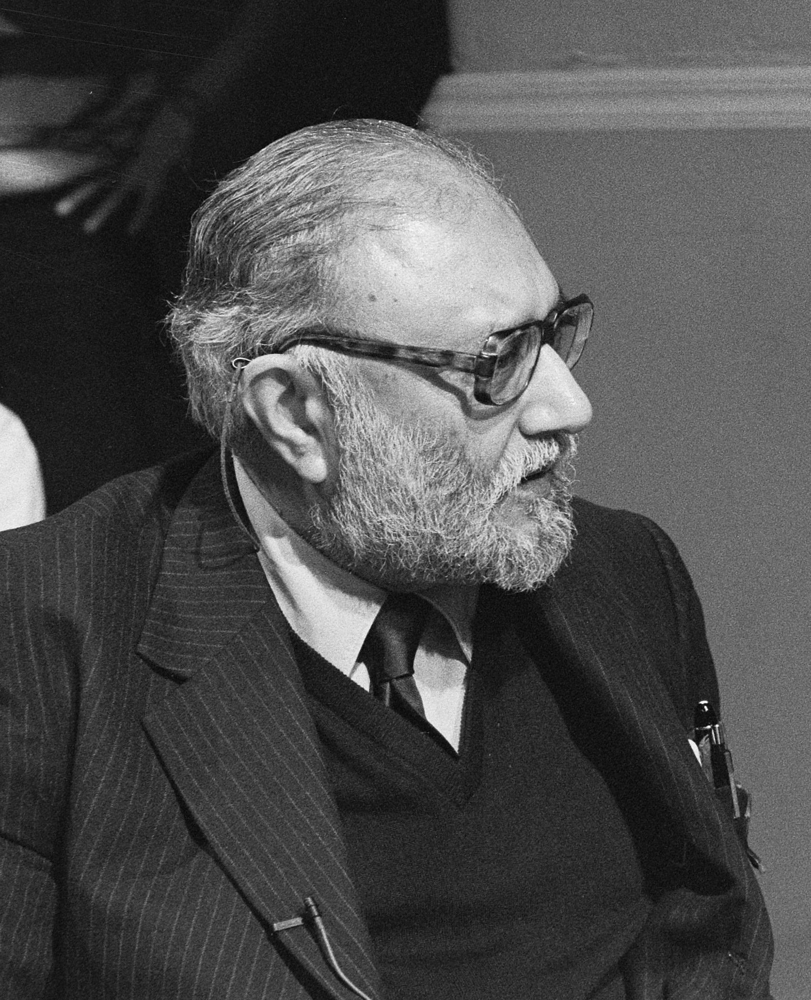

# Abdus Salam (1926–1996)

  
  
<em>Abdus Salam (1926–1996)</em>

## Overview

Mohammad Abdus Salam was a Pakistani theoretical physicist who developed the electroweak theory — the unification of the electromagnetic and weak nuclear forces — sharing the Nobel Prize in Physics in 1979 with Sheldon Glashow and Steven Weinberg. The electroweak theory is a pillar of the Standard Model of particle physics and represents one of the great unifications in the history of physics, placing Salam in the tradition of Maxwell, who unified electricity and magnetism. Salam was the first Pakistani and the first Muslim to receive a Nobel Prize in science, and devoted much of his later career to promoting science in the developing world.

## Early Life and Education

Salam was born on 29 January 1926 in Jhang, in the Punjab region of what was then British India (now Pakistan). His father, Muhammad Hussain, was an education officer. In 1940, at the age of fourteen, Salam scored the highest marks ever recorded in the matriculation examination of the University of Punjab — a record that attracted widespread attention in his home city. In 1946 he won a scholarship to St. John's College, Cambridge, where he read for the Mathematical Tripos, again achieving the highest marks of his year.

He remained at Cambridge for his doctorate, supervised by Nicholas Kemmer and Paul Matthews. His doctoral research in quantum electrodynamics examined overlapping divergences and renormalization — problems at the heart of quantum field theory. He obtained his doctorate in 1952. After a brief time in Pakistan — where he quickly recognized that research conditions were inadequate — he returned to Cambridge as a lecturer, then became professor at Imperial College London in 1957, where he remained until 1993.

## The Electroweak Unification

The weak nuclear force — responsible for radioactive beta decay — was, in the 1950s, described by Fermi's theory as a simple point interaction. There was clearly something deeper to be found. The program of unifying electromagnetism and the weak force — analogous to Maxwell's unification of electricity and magnetism — was pursued by several physicists through the late 1950s and 1960s.

Glashow had outlined a gauge theory of the weak interaction in 1961. In 1967–1968 Salam and Weinberg (working independently, using the recently published Higgs mechanism for giving mass to gauge bosons) each wrote down the complete electroweak theory — a gauge theory based on the symmetry group SU(2) × U(1). The theory predicted:
- A neutral massive boson (the Z boson) mediating weak interactions, in addition to the known charged W bosons
- A massless photon mediating electromagnetism
- Parity violation in the weak force (consistent with Wu's experiment)
- A new phenomenon: neutral current interactions (mediated by the Z)

The neutral currents were observed experimentally at CERN's Gargamelle bubble chamber in 1973, providing crucial confirmation. The W and Z bosons themselves were directly detected at CERN in 1983, in one of the great experimental triumphs of high-energy physics.

The electroweak theory, combined with quantum chromodynamics (the theory of the strong force), forms the **Standard Model** of particle physics — the most successful physical theory ever constructed.

## The International Centre for Theoretical Physics

Salam was deeply concerned about the scientific isolation of scientists in developing countries, who had little access to advanced education, literature, or colleagues. In 1964 he founded the **International Centre for Theoretical Physics (ICTP)** in Trieste, Italy, which provided training and a collegial environment for physicists from Africa, Asia, Latin America, and Eastern Europe.

The ICTP has trained tens of thousands of scientists from over 170 countries and has been widely cited as one of the most successful science development institutions in history. It remains one of Salam's most enduring legacies. He served as its director from its founding until 1993 and fought continuously to maintain its funding and international character.

## Science and Faith

Salam was a devout Muslim of the Ahmadiyya community and saw no contradiction between his faith and his science. He often cited the Quran's injunctions to understand nature as an inspiration for scientific inquiry. He was also a vocal critic of the Pakistani government's 1974 declaration that the Ahmadiyya community was non-Muslim — a decree that imposed serious legal disabilities on his community. The tension between Salam's scientific achievements and his marginalization in Pakistan — despite being its greatest scientist — remains a painful chapter in the country's intellectual history.

He received the Nobel Prize in 1979 and used part of his prize money to support science in Pakistan. His efforts to promote science in the developing world were recognized with honorary degrees from Cambridge, Edinburgh, Trieste, and dozens of other universities.

## Later Life and Death

In his later years Salam suffered from progressive supranuclear palsy, a neurological disease that eventually robbed him of the ability to read or write. He died on 21 November 1996 in Oxford, England.

Despite his international recognition, his grave in Pakistan was vandalized by religious extremists — the word "Muslim" on his tombstone was scraped off. The treatment of Salam in Pakistan became an international symbol of how countries can fail their greatest scientific talents.

## Legacy

The electroweak unification is one of the fundamental achievements of twentieth-century physics. The detection of the Higgs boson at CERN in 2012 — which gives mass to the W and Z bosons in the electroweak theory — was a confirmation of the framework Salam helped build. The ICTP continues to transform the global scientific landscape. Element 118, oganesson, is the heaviest known element; in 2016, the IUPAC named element 113 nihonium — discussions have included honoring Salam, though element naming politics are complex.

## Key Works

- "Weak and Electromagnetic Interactions" (1968) — the electroweak paper (Nobel lecture)
- "On Parity Conservation and Neutrino Mass" (with Ward, 1959)
- *Gauge Unification of Fundamental Forces* (Nobel lecture, 1979)
- *Ideals and Realities: Selected Essays* (1984)
