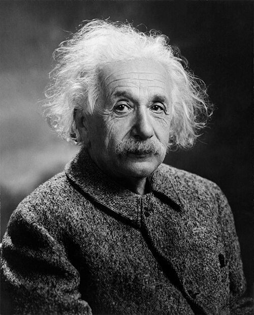

# Albert Einstein (1879–1955)

  
  
<em>Albert Einstein (1879–1955)</em>

## Overview

Albert Einstein was a German-born theoretical physicist who developed the special and general theories of relativity and made foundational contributions to quantum mechanics, statistical mechanics, and cosmology. His 1905 "miracle year" produced four papers — on the photoelectric effect, Brownian motion, special relativity, and mass-energy equivalence — each of which would have secured a major scientific reputation. His 1915 general theory of relativity replaced Newton's theory of gravity with a geometric description of curved spacetime and remains the foundation of modern cosmology. Einstein is the archetypal genius of the modern age: his name is synonymous with creative intelligence.

## Early Life and Education

Einstein was born on 14 March 1879 in Ulm, in the Kingdom of Württemberg, Germany. His father Hermann was an engineer and salesman; his mother Pauline Koch was a musician. The family was Ashkenazi Jewish but not observant. Young Albert showed early curiosity about the hidden world of physics — his father gave him a magnetic compass at five, and its mysterious behavior profoundly affected him.

He attended secondary school in Aarau, Switzerland, and enrolled at the Polytechnic in Zurich (ETH Zurich) in 1896, where he studied physics and mathematics. His independent, questioning style did not endear him to all professors; upon graduating in 1900 he was unable to find an academic position. After two years of tutoring and temporary work, he secured a post as patent examiner at the Swiss Patent Office in Bern in 1902 — a position that gave him financial stability and, crucially, unstructured thinking time.

## The Miracle Year: 1905

While working at the patent office, Einstein published — in a single year — four papers that transformed physics:

1. **Photoelectric effect**: Arguing that light consists of discrete quanta (photons) with energy E = hν, he explained why metals emit electrons when illuminated only above a threshold frequency. This was the first clear demonstration that light is quantized. It won him the Nobel Prize in Physics in 1921.

2. **Brownian motion**: Einstein derived equations predicting the statistical motion of small particles suspended in a fluid, providing definitive evidence for the reality of atoms. Perrin's subsequent experiments confirmed these predictions precisely.

3. **Special relativity**: Building on the Lorentz transformation and the principle that the speed of light is the same for all inertial observers, Einstein's *Zur Elektrodynamik bewegter Körper* (On the Electrodynamics of Moving Bodies) abolished the aether and reformulated the geometry of space and time. Time dilation, length contraction, and the relativity of simultaneity are consequences.

4. **Mass-energy equivalence**: A short follow-up paper derived the most famous equation in science: **E = mc²** — that mass and energy are interconvertible at the rate determined by the square of the speed of light.

## General Relativity

Special relativity applies only to inertial (non-accelerating) frames. Einstein spent a decade extending it to accelerating frames and gravity. The key insight — the equivalence principle — came in 1907: a person in a small, closed room cannot distinguish between gravitational acceleration and uniform acceleration in free space. Gravity is therefore equivalent to acceleration, and a theory of gravity must be a theory of curved spacetime.

The mathematical machinery — Riemannian geometry and tensor calculus — was formidable. Einstein worked through it with the mathematician Marcel Grossmann. In November 1915, in four successive papers presented to the Prussian Academy, he arrived at the field equations of general relativity, which relate the curvature of spacetime to the distribution of matter and energy.

The first triumph came immediately: general relativity predicted that Mercury's perihelion should precess by 43 arcseconds per century more than Newtonian theory — exactly the anomaly that had puzzled astronomers for decades. In 1919 Arthur Eddington's observations of starlight bending around the Sun during a total solar eclipse confirmed another prediction of general relativity, and Einstein became an international celebrity overnight.

## Later Work and Unified Field Theory

After 1915, Einstein spent much of his career in an unsuccessful search for a unified field theory — a theory that would combine electromagnetism and gravity in a single geometric framework. He also became increasingly uncomfortable with quantum mechanics, which he helped found: he objected to its probabilistic interpretation ("God does not play dice"), engaged in famous debates with Bohr at the Solvay Conferences, and wrote the EPR paper (1935) arguing that quantum mechanics is incomplete. Bell's theorem (1964) and subsequent experiments showed that Einstein was wrong about local hidden variables, though his intuitions about quantum entanglement proved fertile.

## Exile and Later Life

With Hitler's rise to power in 1933, Einstein — in the United States for a visit — renounced his German citizenship and accepted a position at the newly founded Institute for Advanced Study in Princeton, New Jersey. He never returned to Germany. In 1939, at the urging of fellow physicists concerned about German nuclear research, he signed a letter to President Roosevelt alerting him to the possibility of nuclear weapons. This letter contributed to the initiation of the Manhattan Project, though Einstein himself played no role in it and later expressed anguish about the atomic bombings of Japan.

Einstein became an American citizen in 1940. He died on 18 April 1955 in Princeton, having refused an operation for his abdominal aortic aneurysm ("I want to go when I want. It is tasteless to prolong life artificially"). His brain was removed for research — controversially and without full family consent.

## Legacy

Einstein's legacy pervades modern physics and technology. GPS satellites require corrections from both special and general relativity. Gravitational waves — predicted by general relativity in 1916 — were directly detected by LIGO in 2015. The cosmological constant he introduced (and retracted) is now invoked to explain dark energy. The photoelectric effect underpins solar cells and digital cameras. His name has become a cultural shorthand for genius.

## Key Works

- "Über einen die Erzeugung und Verwandlung des Lichtes betreffenden heuristischen Gesichtspunkt" (1905) — photoelectric effect
- "Zur Elektrodynamik bewegter Körper" (1905) — special relativity
- "Die Grundlage der allgemeinen Relativitätstheorie" (1916) — general relativity
- "Kann die quantenmechanische Beschreibung der physikalischen Wirklichkeit als vollständig betrachtet werden?" (with Podolsky and Rosen, 1935) — the EPR paper
