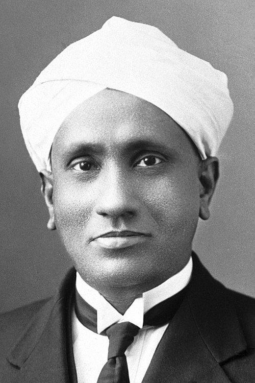

# C.V. Raman — Chandrasekhara Venkata Raman (1888–1970)

  
  
<em>C.V. Raman — Chandrasekhara Venkata Raman (1888–1970)</em>

## Overview

Chandrasekhara Venkata Raman was an Indian physicist who discovered the Raman effect — the inelastic scattering of light by molecules, in which scattered photons gain or lose energy by interacting with molecular vibrations or rotations. Announced on 28 February 1928, the Raman effect provided a powerful new tool for probing the structure of molecules and materials. Raman received the Nobel Prize in Physics in 1930, becoming the first Asian and the first non-white person to win a Nobel Prize in science. The day of his discovery is now celebrated in India as National Science Day.

## Early Life and Education

Raman was born on 7 November 1888 in Tiruchirapalli, Tamil Nadu (then part of the Madras Presidency of British India). His father, Chandrasekhara Ramanathan Iyer, was a physics and mathematics lecturer. The intellectual household nurtured Raman's early passion for science — he read advanced texts far beyond his years. He enrolled at Presidency College, Madras, where he obtained his BSc at fifteen and his MSc at seventeen, both with the highest marks ever recorded at the institution. His MSc dissertation was published in a British scientific journal — an extraordinary achievement for a student in colonial India.

He could not study in Britain because of ill health, so he took the Financial Civil Service examination and placed first, accepting a post as assistant accountant general in Calcutta. He served in this capacity for a decade (1907–1917) while conducting physics research in his spare time at the laboratories of the Indian Association for the Cultivation of Science, rising to work there before dawn and after work.

## Discovery of the Raman Effect

In 1917 Raman was offered the first Palit Professorship of Physics at the University of Calcutta — an endowed chair funded by Indian philanthropy. He left government service to accept it.

Raman had long been fascinated by the color of the deep sea and sky. He correctly identified Rayleigh scattering (elastic scattering of light from molecules) as the cause of blue sky, but suspected something more was occurring. He conducted years of careful experiments on scattered light using sunlight as a source and simple spectroscopic equipment.

On 28 February 1928, he and his student K.S. Krishnan observed a new type of scattered light: in addition to the elastically scattered light (same wavelength as the incident beam), molecules scattered a small fraction of photons at *shifted* wavelengths — both longer and shorter wavelengths — corresponding to the molecular vibration and rotation frequencies. This is the **Raman effect** (or Raman scattering):

- When a photon excites a molecule and the molecule returns to a higher vibrational state, the scattered photon has lower energy (longer wavelength) — Stokes Raman scattering.
- When a photon interacts with an already-excited molecule and gains energy, the scattered photon has higher energy (shorter wavelength) — anti-Stokes Raman scattering.

The frequency shifts correspond directly to the vibrational and rotational frequencies of the molecule — a unique "fingerprint" of its chemical structure. The Raman effect was predicted theoretically by Kramers and Heisenberg in 1925 but Raman's was the first experimental observation.

The announcement on 28 February 1928 was a scientific sensation. Raman had used simple, improvised equipment — filtered sunlight, a telescope, and colored glass filters — where others had not yet succeeded even with mercury arc lamps and sophisticated spectrographs. He immediately submitted the discovery and within days received the Nobel Prize nomination.

## Raman Spectroscopy

Within years, Raman spectroscopy became an invaluable analytical tool in chemistry, materials science, biology, and forensics. It allows:
- Identification of chemical compounds without destructive sampling
- Analysis of molecular structure and bonding
- Study of crystal vibrations and phase transitions
- Identification of minerals and artwork pigments
- Medical diagnostics (detection of cancer cells, drug analysis)

Modern Raman spectroscopy uses lasers and charge-coupled detectors; handheld Raman spectrometers are now used for everything from airport security to pharmaceutical quality control.

## Indian Institute of Science and Later Career

In 1933 Raman moved to Bangalore to become director of the Indian Institute of Science (IISc) and later founded the Raman Research Institute in 1948, which he directed until his death. He worked on the optics of diamonds, the acoustics of musical instruments (particularly Indian instruments), and the physiology of vision.

Raman was a commanding and often difficult personality — imperious, demanding of his students, and fiercely nationalist about Indian science. He refused to accept British scientific authority uncritically and was willing to challenge the establishment. He established the Indian Journal of Physics and the Indian Academy of Sciences, building infrastructure for Indian science at a time of colonial rule and early independence.

He was knighted in 1929 and received the Bharat Ratna (India's highest civilian honor) in 1954. He died on 21 November 1970 in Bangalore, aged eighty-two.

## Legacy

The Raman effect is one of the most important and practically useful discoveries in spectroscopy. Raman spectroscopy is now a $1 billion+ industry and a standard analytical technique worldwide. Raman's career also represents a landmark in the history of science in the Global South: a scientist working in colonial India, with modest resources, made one of the fundamental discoveries of the twentieth century through ingenuity and careful observation.

## Key Works

- "A New Type of Secondary Radiation" (with Krishnan, Nature, 1928) — the Raman effect
- "The Diffraction of Light by High Frequency Sound Waves" (1936)
- *The New Physics: Talks on Aspects of Science* (1951)
