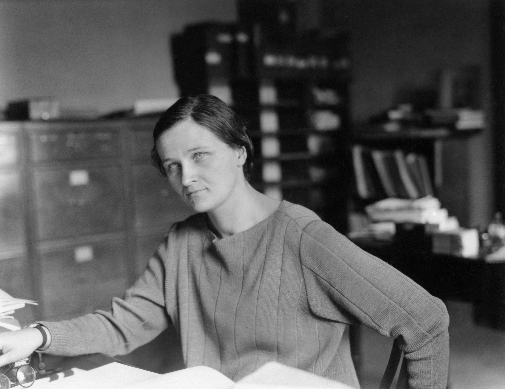

# Cecilia Payne-Gaposchkin (1900–1979)

  
  
<em>Cecilia Payne-Gaposchkin (1900–1979)</em>

## Overview

Cecilia Helena Payne-Gaposchkin was a British-American astronomer and astrophysicist whose 1925 doctoral thesis determined that stars are composed primarily of hydrogen and helium — the most abundant elements in the universe. This was arguably the most important doctoral thesis in the history of astronomy, yet she was initially pressured to retract her findings by a senior astronomer who later published the same conclusion as his own. Despite these obstacles she went on to a distinguished career at Harvard, eventually becoming the first woman to be promoted to full professor at Harvard University.

## Early Life and Education

Payne was born on 10 May 1900 in Wendover, Buckinghamshire, England, the eldest of three children. Her father, Edward John Payne, was a London barrister and historian who died when Cecilia was four, leaving the family in straitened circumstances. Her mother, Emma Leonora Helena Pertz, encouraged her children's intellectual interests.

She won a scholarship to Newnham College, Cambridge, in 1919, where she studied botany, physics, and chemistry. At Cambridge, women could attend lectures and take the examinations but could not receive degrees — Cambridge did not grant degrees to women until 1948. A lecture by Arthur Eddington on his 1919 eclipse expedition (which confirmed Einstein's general relativity) sparked her passion for astronomy. After completing her studies without a degree she recognized that opportunities for a woman astronomer in Britain were severely limited.

She moved to the United States in 1923, enrolling at Radcliffe College (Harvard's coordinate college for women) to work under the Harvard astronomer Harlow Shapley. Harvard had a tradition of employing women astronomers — the "Harvard Computers" — but in junior, poorly paid roles.

## The Composition of Stars

For her doctoral dissertation, Payne applied the newly developed tools of quantum mechanics and atomic spectroscopy to the analysis of stellar spectra — the characteristic absorption lines produced when atoms in a star's atmosphere absorb specific wavelengths of light. Using the Saha ionization equations (which described how the degree of ionization of an element depends on temperature and pressure), she could calculate from the relative strengths of spectral lines the relative abundances of elements at different temperatures.

Her conclusion was startling: hydrogen is overwhelmingly the most abundant element in stellar atmospheres — about a million times more abundant than the metals observed on Earth — followed by helium. All stars show the same approximate composition, and the great variety of stellar spectra reflects differences in temperature, not composition.

This finding contradicted the prevailing view — supported by Henry Norris Russell, then the most authoritative American astronomer — that stellar composition was roughly similar to Earth's. When Payne submitted her thesis, Russell told her the hydrogen result was "clearly impossible." Under his pressure, she added a note stating her result was "almost certainly not real." Her thesis, *Stellar Atmospheres* (1925), was nonetheless submitted and published — described by the astronomer Otto Struve as "undoubtedly the most brilliant PhD thesis ever written in astronomy."

## Russell's Reversal and the Righting of the Record

In 1929 Russell published his own analysis confirming Payne's earlier conclusion: stars are indeed predominantly hydrogen. He did not give Payne full credit. Though later historians have documented the priority clearly, Payne's role was for decades underappreciated. Only in later years was her precedence fully acknowledged; by then, however, the priority had become academic.

## Harvard Career

After her doctorate, Payne continued at Harvard in an unofficial and poorly paid status for years — her early positions were funded through grants and listed under other astronomers' names, as Harvard had no formal rank for women scientists. She worked on stellar spectra, variable stars, and novae. In 1934 she married the Russian-born astronomer Sergei Gaposchkin, who had fled Nazi Germany; she was instrumental in helping him emigrate to the United States.

Together, the Gaposchkins systematically studied millions of variable star observations using Harvard's photographic plate collection — tedious, meticulous, and scientifically productive work that resulted in landmark catalogues of variable stars in the Milky Way and the Magellanic Clouds.

In 1938 her official title at Harvard was finally changed to "astronomer" (rather than "technical assistant"). In 1956 she was appointed Phillips Professor of Astronomy and chair of the Department of Astronomy — the first woman to hold a named professorship and to chair a department at Harvard. She said of the milestone: "The world should be told that Harvard has kept its word and given a woman a professorship in the Faculty of Arts and Sciences."

## Later Life and Legacy

She continued active research into her seventies, supervising graduate students and publishing prolifically on stellar evolution and variable stars. She was elected to the American Academy of Arts and Sciences, the American Philosophical Society, and the American Astronomical Society, of which she served as vice-president. She received honorary degrees from numerous institutions.

Payne-Gaposchkin died on 7 December 1979 in Cambridge, Massachusetts. The asteroid 2039 Payne-Gaposchkin is named in her honor, as is the Payne-Gaposchkin Medal of the Astronomical Society of Australia. Her autobiography, *The Dyer's Hand* (published posthumously in 1984), remains a compelling account of a life in science under conditions of institutional gender discrimination.

## Legacy

Her discovery that stars are made mostly of hydrogen and helium is foundational to all of modern astrophysics — it underlies stellar evolution theory, Big Bang nucleosynthesis, and our understanding of the chemical history of the universe. It is one of the most important discoveries in twentieth-century astronomy.

## Key Works

- *Stellar Atmospheres* (doctoral thesis, 1925)
- *The Stars of High Luminosity* (1930)
- *Variable Stars and Galactic Structure* (1954)
- *Galactic Novae* (1957)
