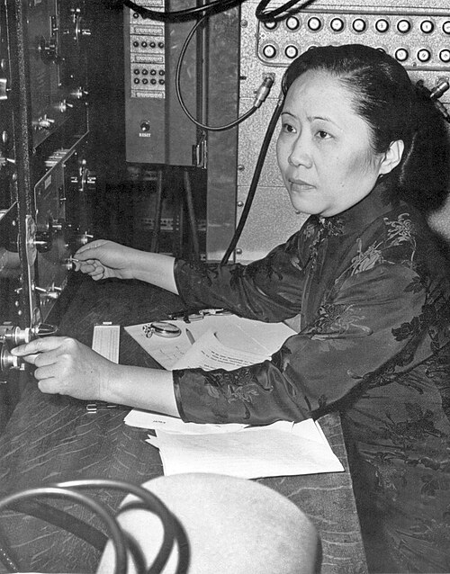

# Chien-Shiung Wu (1912–1997)

  
  
<em>Chien-Shiung Wu (1912–1997)</em>

## Overview

Chien-Shiung Wu was a Chinese-American experimental physicist whose 1956 experiment overthrew one of the most fundamental assumptions in physics — that the laws of nature are the same in a mirror image of the universe. Her demonstration that parity is not conserved in the weak nuclear force shocked the physics world, directly confirmed the theoretical prediction of Lee and Yang, and earned Lee and Yang the Nobel Prize in Physics in 1957. That Wu herself was not included in the Nobel award is widely considered one of the most glaring oversights in the prize's history. Known as the "First Lady of Physics" and the "Chinese Marie Curie," Wu also made major contributions to the experimental verification of beta decay theory and to the understanding of nuclear physics.

## Early Life and Education

Wu was born on 31 May 1912 in Liuhe, a small town near Shanghai, China. Her father, Wu Zhongyi, was an engineer and school founder who believed in education for girls — unusual for the era. Chien-Shiung (meaning "strong hero") attended the Ming De School her father founded and later studied at the Suzhou Women's Normal School, then at the National Central University in Nanjing, graduating in 1934 with a degree in physics.

Her professors and mentors encouraged her to pursue graduate study abroad. In 1936 she sailed to the United States to attend the University of Michigan — then, on the advice of a Chinese physicist at Berkeley, transferred to the University of California, Berkeley, to study under Emilio Segrè. She received her doctorate in 1940, her dissertation addressing the radioactive isotopes of xenon, work relevant to uranium fission.

Despite her excellent record, Wu faced a double barrier: racial discrimination against Chinese immigrants and gender discrimination in academic hiring. She taught briefly at Smith College and Princeton (becoming the first woman ever to teach there) before joining Columbia University in 1944, where she remained for the rest of her career.

## War Work: The Manhattan Project

During World War II Wu was recruited to work on the Manhattan Project as a staff scientist at the Substitute Alloy Materials (SAM) laboratory at Columbia. She worked on radiation detectors and on a crucial problem: why did the gaseous diffusion process for separating uranium isotopes keep failing? Wu identified the culprit — xenon-135, a neutron-absorbing fission product that was "poisoning" the reactors. Her solution saved the project months and was essential to the eventual success of the enrichment process.

## Experimental Verification of Beta Decay Theory

In the late 1940s Wu conducted definitive experiments on beta decay that confirmed Fermi's theory with extraordinary precision. She measured the spectra of electrons emitted in the beta decay of copper-64 and showed that Fermi's theory predicted the spectra correctly. She also showed that both the electron and the antineutrino are emitted in beta decay — directly confirming the two-component theory. These were painstaking, technically demanding experiments that required Wu's exceptional skill in low-energy nuclear spectroscopy.

## The Wu Experiment: Parity Violation

In 1956 theorists Tsung-Dao Lee and Chen-Ning Yang analyzed published experiments and realized that parity conservation in the weak force had never actually been tested — it had simply been assumed. They published a theoretical paper proposing that the weak force might violate parity and suggesting several experiments to test it.

Wu immediately recognized the importance of the challenge and designed the key experiment. She collaborated with low-temperature physicists at the National Bureau of Standards (now NIST) in Washington, because the experiment required extremely low temperatures to align atomic nuclei.

The experiment observed the beta decay of cobalt-60 nuclei whose spins had been aligned by a strong magnetic field at very low temperature (about 0.01 K). Parity conservation would predict that equal numbers of electrons should be emitted in both directions relative to the spin axis. Instead, Wu found a dramatic asymmetry: far more electrons were emitted opposite to the direction of the nuclear spin than parallel to it.

The result was announced in January 1957 and stunned the physics community. Wolfgang Pauli, who had bet on parity conservation, wrote: "I am shocked not so much by the fact that the Lord prefers the left hand as by the fact that He still appears to be left-right symmetric when He expresses Himself strongly." The weak force — uniquely among the fundamental forces — distinguishes between left and right, between matter and its mirror image.

Lee and Yang received the Nobel Prize in Physics in 1957 for the theoretical prediction. Wu, whose experimental confirmation made the discovery concrete and who had done the harder technical work, was not included. The Nobel Committee's reasoning has never been made fully transparent. Many physicists and historians consider this the worst such omission in Nobel history.

## Later Career and Recognition

Wu continued at Columbia as a professor (full professor from 1958) and continued important research in nuclear physics, including work on the Mössbauer effect and on the experimental testing of the two-photon correlation in positronium annihilation (which tested quantum mechanical predictions of entanglement, though that language was not used at the time).

She received the National Medal of Science in 1975, the first woman president of the American Physical Society (1975), the Wolf Prize in Physics in 1978 (the first year it was awarded), and honorary doctorates from universities worldwide. She was elected to the National Academy of Sciences and to numerous international academies.

Wu retired from Columbia in 1981 and died on 16 February 1997 in New York City following a stroke.

## Legacy

The Wu experiment is one of the most important experiments in the history of physics. The discovery of parity violation was essential to the development of the electroweak theory (Glashow, Salam, Weinberg — Nobel 1979) and to the Standard Model of particle physics. Wu's meticulous experimental technique, her courage in tackling foundational questions, and her persistence in the face of discrimination make her one of the defining figures of twentieth-century experimental physics.

## Key Works

- "Experimental Test of Parity Conservation in Beta Decay" (with Ambler, Hayward, Hoppes, Hudson, 1957)
- "The Continuous X-Rays Excited by the Beta-Particles of 32P" (1941)
- *Beta Decay* (textbook, 1965)
