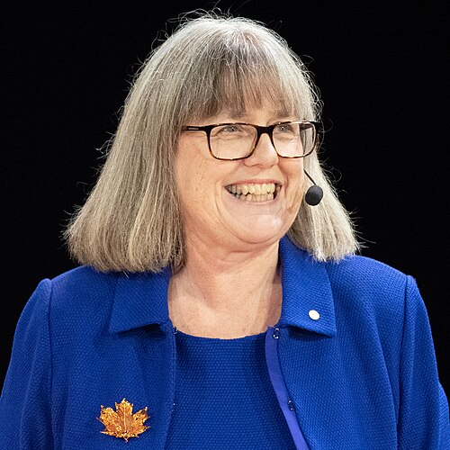

# Donna Strickland (born 1959)

  
  
<em>Donna Strickland (born 1959)</em>

## Overview

Donna Theo Strickland is a Canadian physicist who shared the Nobel Prize in Physics in 2018 with Gérard Mourou for the development of chirped pulse amplification (CPA) — a technique that made it possible to produce laser pulses of extremely high peak intensity without destroying the laser itself. CPA transformed laser physics and enabled a wide range of applications from laser eye surgery (LASIK) to particle accelerator development and the study of attosecond-scale phenomena. Strickland became the third woman ever to win the Nobel Prize in Physics (after Marie Curie in 1903 and Maria Goeppert Mayer in 1963) and the first in fifty-five years.

## Early Life and Education

Strickland was born on 27 May 1959 in Guelph, Ontario, Canada. She grew up in a family that valued education; her father was an electrical engineer. She attended secondary school in Guelph and developed an interest in physics and applied science. She enrolled at McMaster University in Hamilton, Ontario, and graduated with a bachelor's degree in engineering physics in 1981.

She then enrolled in the graduate program in optics at the University of Rochester in New York, working under Gérard Mourou in the Laboratory for Laser Energetics. This collaboration produced her doctoral research and the Nobel-winning discovery. She completed her doctorate in 1989.

## Chirped Pulse Amplification

The central challenge in producing ultra-high-intensity laser pulses in the 1980s was a fundamental physical constraint: when short pulses are amplified to high peak powers, the electric field of the pulse becomes so intense that it damages or destroys the optical components of the laser — the crystals, mirrors, and gain media through which the pulse passes.

The standard approach was to use large-aperture optics to spread out the beam and reduce intensity, but this approach was expensive, physically bulky, and had practical limits.

Strickland and Mourou's key insight (published in 1985 in their doctoral collaboration) was borrowed from radar technology: **chirped pulse amplification**. The process works in three steps:

1. **Stretch**: Take a short, intense laser pulse and "chirp" it — stretch it in time by a factor of one thousand to ten thousand, using a dispersive element (a diffraction grating arrangement). The stretched pulse has much lower peak intensity.

2. **Amplify**: Pass the stretched, lower-intensity pulse through the gain medium of a laser amplifier. Because peak intensity is low, the amplifier is not damaged. The pulse gains energy.

3. **Compress**: After amplification, recompress the pulse back to its original short duration using an inverse dispersive element. The result is a pulse with both high total energy (from amplification) and high peak power (from compression).

CPA increased the peak intensity of laser pulses by a factor of more than a thousand compared to what had been possible before. It enabled tabletop lasers to reach intensities that had previously required room-sized or building-sized facilities.

## Applications of CPA

Chirped pulse amplification has transformed numerous fields:

- **LASIK eye surgery**: CPA lasers cut the cornea with extraordinary precision, too fast for heat to damage surrounding tissue. CPA-based LASIK has been performed on tens of millions of patients worldwide.
- **Ultrafast science**: CPA lasers can produce pulses short enough to photograph electron motion in molecules — in the attosecond (10⁻¹⁸ second) regime. This enabled the field of attosecond science, for which the 2023 Nobel Prize in Physics was awarded (to Agostini, Krausz, and L'Huillier).
- **Materials processing**: Precise cutting and micromachining of materials, including biological tissue, glass, and semiconductors.
- **Particle acceleration**: Laser-driven particle accelerators use CPA pulses to accelerate electrons and protons over millimeter distances to energies that would require conventional accelerators of meters.
- **Nuclear physics**: Some CPA-based lasers approach intensities where nuclear physics effects become relevant.

## Recognition Before and After Nobel

Before the Nobel Prize, Strickland held a relatively modest position as an associate professor at the University of Waterloo — notable primarily because, despite her foundational contribution to laser physics, she had not been promoted to full professor and was not a Fellow of the Royal Society of Canada. When the Nobel was announced, it emerged that a Wikipedia article about her had been rejected by Wikipedia editors for lack of "notability" months before the prize was announced.

Her Nobel Prize sparked widespread discussion about how women in science are systematically underrecognized during their careers compared to their male peers, even when their contributions are equally or more fundamental.

She was promoted to full professor at Waterloo after the Nobel announcement. She was subsequently elected to the Royal Society of Canada, the National Academy of Sciences, and the Royal Society (London). She received honorary degrees from numerous institutions.

## Later Work

Strickland continues to work at the University of Waterloo on the development and application of intense laser pulses, including high-power fiber laser systems and their applications in materials and biology. She is a frequent speaker on the importance of supporting women in physics and science more broadly.

## Legacy

Chirped pulse amplification is now a standard technique in laser laboratories worldwide and has directly enabled medical procedures that have improved the vision of tens of millions of people. Strickland's Nobel Prize and the discussions it provoked about women's recognition in science have had lasting effects on conversations about equity in physics and academia.

## Key Works

- "Compression of Amplified Chirped Optical Pulses" (with Mourou, Optics Communications, 1985) — the CPA discovery paper
- "Characterization of Self-Phase-Modulated Optical Pulses" (doctoral thesis, 1989)
- Various papers on ultrafast laser development and applications
