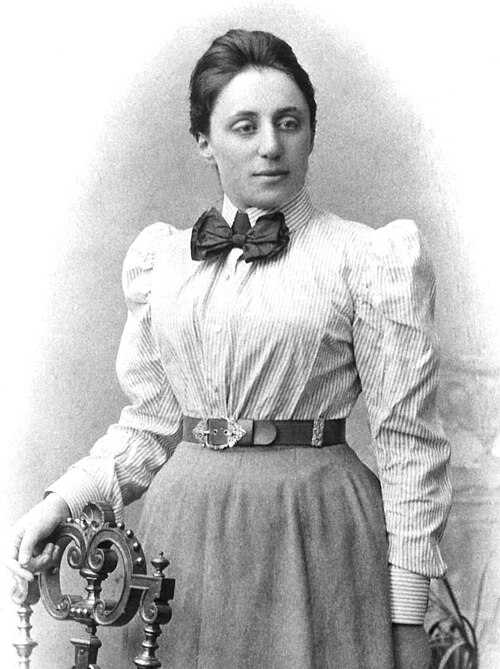

# Emmy Noether (1882–1935)

  
  
<em>Emmy Noether (1882–1935)</em>

## Overview

Amalie Emmy Noether was a German mathematician whose work in abstract algebra and theoretical physics transformed both disciplines. Her 1915 theorem — now universally called Noether's theorem — is one of the most profound results in theoretical physics: it proves that every continuous symmetry of a physical system corresponds to a conserved quantity. The conservation of energy corresponds to time-translation symmetry; conservation of momentum corresponds to spatial-translation symmetry; conservation of angular momentum corresponds to rotational symmetry. This result underlies virtually all of modern physics. Einstein called her "the most significant creative mathematical genius thus far produced."

## Early Life and Education

Emmy Noether was born on 23 March 1882 in Erlangen, Bavaria, Germany, the eldest of four children. Her father, Max Noether, was himself a distinguished mathematician at the University of Erlangen. Growing up in a mathematical household, Emmy showed early aptitude, though as a girl she was expected to study languages and domestic arts. She passed the state examination to teach French and English in girls' schools.

At twenty-one, despite restrictions on women, she was permitted to audit lectures at the University of Erlangen (women could only audit, not matriculate). She also attended lectures at the University of Göttingen. When Erlangen changed its policy in 1904 and permitted women to enroll, Noether formally registered and completed her doctorate in 1907 under the algebraist Paul Gordan, with a dissertation on invariant theory. She was one of the first women to earn a doctorate in mathematics in Germany.

For the next seven years she worked without pay at Erlangen, substituting for her father and publishing research — a common fate for women academics who could not hold official positions.

## Noether's Theorem (1915)

When Einstein was developing general relativity, mathematicians at Göttingen — particularly Felix Klein and David Hilbert — recognized that the theory raised deep questions about energy conservation. They invited Noether to Göttingen to address these issues. She proved two theorems, now called Noether's First and Second Theorems, presented in 1915 and published in 1918.

**Noether's First Theorem** (the more famous): For every differentiable symmetry of the action of a physical system, there is a corresponding conservation law. Specifically:
- **Time-translation symmetry** → **conservation of energy**
- **Spatial-translation symmetry** → **conservation of momentum**
- **Rotational symmetry** → **conservation of angular momentum**
- **Gauge symmetry** → **conservation of electric charge**

This is not merely an interesting result; it is the deepest unifying principle in theoretical physics. Every conservation law in nature corresponds to a symmetry, and vice versa. The theorem applies to classical mechanics, electrodynamics, quantum mechanics, and quantum field theory. It is the conceptual backbone of the Standard Model of particle physics.

Noether's Second Theorem addressed the gauge symmetries of general relativity and explained why energy conservation takes a special, local form in that theory.

## Struggles for Recognition

Despite her extraordinary contributions, institutional sexism prevented Noether from holding official academic positions for years. When Klein and Hilbert sought to make her a Privatdozent (an unsalaried lecturer) at Göttingen, the philosophy faculty objected: "What will our soldiers think when they return to the university and find that they are required to learn at the feet of a woman?" Hilbert's reply was characteristically sharp: "I do not see that the sex of the candidate is an argument against her admission as a Privatdozent. After all, we are a university, not a bath house."

She was finally permitted to lecture (under Hilbert's name at first) in 1919, and obtained an unofficial, minimally paid position. Only in 1923 did she receive modest compensation. She was never given a tenured professorship in Germany.

## Abstract Algebra

From the early 1920s, Noether turned her attention to abstract algebra and produced work that transformed the discipline. Her 1921 paper on ideal theory in rings established the theory of what are now called **Noetherian rings** (rings in which every ascending chain of ideals stabilizes). This abstract, axiomatic approach — extracting the essential algebraic structure from concrete cases — characterized a revolution in mathematical thinking that Noether led.

Her 1927 paper with Helmut Hasse and Richard Brauer on the structure of division algebras solved a central problem in algebra. Her work on representation theory of algebras and on the cohomology of groups was foundational. The generation of algebraists she trained — "Noether's boys," though many were girls — spread her structural approach across Europe and America.

## Exile and Final Years

When the Nazis came to power in 1933, Noether — Jewish — was among the first scholars dismissed under the Law for the Restoration of the Professional Civil Service. She received an invitation from Bryn Mawr College in Pennsylvania and from the Institute for Advanced Study in Princeton, and emigrated to the United States in 1933. She thrived at Bryn Mawr, enjoying the collegial environment and the absence of the institutional barriers she had faced in Germany.

She died unexpectedly on 14 April 1935, four days after surgery to remove an ovarian cyst, at fifty-three. Einstein published an obituary in the New York Times: "In the judgment of the most competent living mathematicians, Fräulein Noether was the most significant creative mathematical genius thus far produced, so far as women are concerned. In the realm of algebra, in which the most gifted mathematicians have been busy for centuries, she discovered methods which have proved of enormous importance."

## Legacy

Noether's theorem is taught in every graduate course in theoretical physics and is the central organizing principle of the Standard Model. Noetherian rings and Noetherian modules are standard concepts in abstract algebra. The asteroid 7001 Noether and the Noether crater on the Moon are named in her honor. Several universities have named buildings or institutes after her.

## Key Works

- "Invariante Variationsprobleme" (Invariant Variation Problems, 1918) — Noether's theorem
- "Idealtheorie in Ringbereichen" (Ideal Theory in Ring Domains, 1921)
- "Abstrakter Aufbau der Idealtheorie in algebraischen Zahl- und Funktionenkörpern" (1927)
- "Hyperkomplexe Größen und Darstellungstheorie" (1929)
