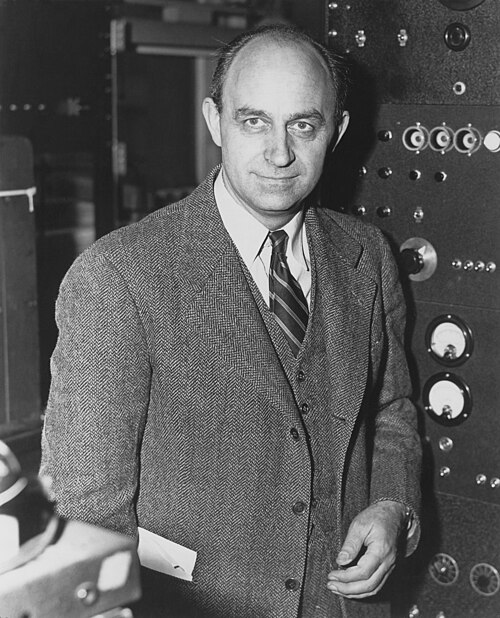

# Enrico Fermi (1901–1954)

  
  
<em>Enrico Fermi (1901–1954)</em>

## Overview

Enrico Fermi was an Italian-American physicist who achieved mastery of both theoretical and experimental physics — a combination so rare in the twentieth century that it earned him the nickname "the last man who knew everything in physics." He developed the statistical mechanics of particles obeying the exclusion principle (Fermi-Dirac statistics), created a quantitative theory of beta decay, demonstrated the first artificial nuclear chain reaction, and played a central role in the Manhattan Project. He received the Nobel Prize in Physics in 1938.

## Early Life and Education

Fermi was born on 29 September 1901 in Rome, Italy. His father, Alberto Fermi, was a railroad inspector; his mother, Ida de Gattis, was a schoolteacher. Tragedy struck when Fermi was fourteen and his brother Giulio died suddenly during a minor throat operation — an event that devastated Enrico and drove him deeper into physics as a solace.

He was largely self-taught in physics up to university level, acquiring two used physics texts at the Campo de' Fiori market and mastering them entirely. He entered the Scuola Normale Superiore in Pisa (one of Italy's most elite institutions) on a scholarship at seventeen and completed his doctorate in 1922 at twenty-one, with a dissertation on X-ray diffraction. He then spent time in Göttingen under Born and in Leiden under Ehrenfest, absorbing the latest quantum theory. He became professor of theoretical physics at the University of Rome in 1926 at twenty-four.

## Fermi-Dirac Statistics

In 1926, recognizing that particles obeying the Pauli exclusion principle needed their own statistical mechanics (distinct from the Bose-Einstein statistics of particles without the exclusion restriction), Fermi derived the statistical distribution for such particles — simultaneously and independently with Dirac. The **Fermi-Dirac distribution** describes how fermions (electrons, protons, neutrons, and all particles with half-integer spin) populate available energy states at thermal equilibrium. At absolute zero, fermions fill all states up to the Fermi energy; above it, all states are empty.

Fermi-Dirac statistics explains the electrical conductivity of metals, the behavior of semiconductors, the structure of white dwarf stars (which are supported against gravitational collapse by electron degeneracy pressure — Fermi pressure), and the properties of neutron stars.

## Theory of Beta Decay

In 1933–1934 Fermi constructed a complete quantitative theory of beta decay — the process by which a neutron in a nucleus transforms into a proton, emitting an electron and a neutrino (Pauli's hypothetical particle). Fermi's theory introduced the **weak nuclear force** as a new fundamental force distinct from electromagnetism and gravity, characterized it mathematically in analogy with electrodynamics, and predicted the shape of the electron energy spectrum in beta decay.

The paper was initially rejected by Nature as "too speculative." Fermi published it in Italian and German journals instead. It was one of the great theoretical papers of the century; Fermi's theory of beta decay, suitably modernized, remains the foundation of weak interaction physics.

## Slow Neutrons and the Via Panisperna Boys

In Rome in 1934, Fermi and his group — the "boys of Via Panisperna" (named for the street where their laboratory was located) — began bombarding elements with neutrons to produce radioactive isotopes. They discovered that slowing neutrons down (by passing them through water or paraffin wax) dramatically increased the rate of nuclear reactions — slow neutrons are far more effective at inducing nuclear transformations than fast ones. This crucial discovery (which Fermi received the Nobel Prize for) was the foundation for the design of nuclear reactors.

During these experiments the group produced what they believed to be transuranic elements (elements beyond uranium). They were actually producing nuclear fission — splitting uranium nuclei — without recognizing it. The discovery of fission awaited Hahn, Strassmann, and Meitner four years later.

## Escape from Fascism and the Manhattan Project

In 1938 Fermi traveled with his wife Laura and children to Stockholm to receive his Nobel Prize — and did not return to Fascist Italy. His wife was Jewish and the racial laws enacted that year endangered her. The family emigrated directly to the United States, where Fermi joined Columbia University and then the University of Chicago.

At Chicago, Fermi led the team that built **Chicago Pile-1** — the world's first artificial nuclear reactor. On 2 December 1942, in a converted squash court under the stands of Stagg Field at the University of Chicago, the reactor went critical: a self-sustaining nuclear chain reaction had been achieved for the first time. Fermi's terse message to project headquarters: "The Italian navigator has entered the new world." This was the decisive demonstration that nuclear fission could be controlled and sustained, making nuclear power (and the bomb) feasible.

Fermi then moved to Los Alamos, New Mexico, as a senior consultant on the Manhattan Project, contributing to the design of both the uranium and plutonium bombs.

## Fermilab and Legacy

After the war Fermi returned to Chicago, where he was appointed Distinguished Service Professor. He worked on cosmic rays, particle physics, and the early uses of computers for physics calculations. His famous "Fermi problems" — order-of-magnitude estimates of complex quantities (such as "How many piano tuners are there in Chicago?") — became a pedagogical tradition and are still used in physics education and technical interviews.

He died of stomach cancer on 28 November 1954 in Chicago, at fifty-three. Element 100, fermium (Fm), is named in his honor. Fermilab (Fermi National Accelerator Laboratory) in Batavia, Illinois, is also named after him.

## Legacy

Fermi's contributions span statistical mechanics, nuclear physics, weak interaction theory, and experimental nuclear reactor design. His combination of theoretical depth and experimental skill — extraordinary in the modern era of specialization — makes him one of the most complete physicists of the twentieth century.

## Key Works

- "Sulla quantizzazione del gas perfetto monoatomico" (1926) — Fermi-Dirac statistics
- "Versuch einer Theorie der β-Strahlen" (1934) — theory of beta decay
- "Production and Absorption of Slow Neutrons" (with Amaldi, 1936)
- *Nuclear Physics* (course notes compiled by students, 1949)
