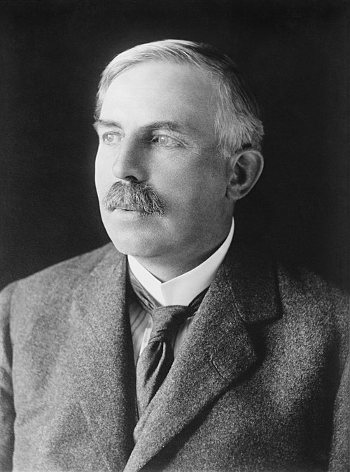

# Ernest Rutherford (1871–1937)

  
  
<em>Ernest Rutherford (1871–1937)</em>

## Overview

Ernest Rutherford was a New Zealand-born British physicist who is considered the father of nuclear physics. He discovered the nuclear structure of the atom, demonstrated that radioactivity involves the transmutation of elements, and achieved the first artificial nuclear reaction. His 1911 gold foil experiment — one of the most famous experiments in the history of science — revealed that the atom consists almost entirely of empty space with a tiny, massive, positively charged nucleus at its center. He received the Nobel Prize in Chemistry in 1908 and trained more Nobel laureates than any other scientist.

## Early Life and Education

Rutherford was born on 30 August 1871 in Brightwater, near Nelson, New Zealand, the fourth of twelve children of a Scottish father and English mother. The family farmed and operated a flax mill. He won a scholarship to Nelson College and then to Canterbury College in Christchurch, where he graduated with degrees in mathematics and physical science. In 1895 he won an 1851 Exhibition Scholarship to Cambridge and entered the Cavendish Laboratory as J.J. Thomson's first research student admitted from overseas.

## Early Work on Radioactivity

At Cambridge, Rutherford studied the newly discovered X-rays and then turned to the radiation from uranium that Becquerel had discovered in 1896. By 1898 he had established that uranium emits two distinct types of radiation — "alpha" rays, which were easily stopped by a thin sheet of paper, and "beta" rays, which were more penetrating. (Gamma rays were identified separately by Paul Villard in 1900.)

In 1898 Rutherford moved to McGill University in Montreal, where, with the chemist Frederick Soddy, he made a revolutionary discovery: radioactivity involves the spontaneous transmutation of one element into another. This was heretical — the immutability of elements had been assumed since Lavoisier — but the evidence was overwhelming. Rutherford and Soddy showed that radioactive decay produces helium and new elements and follows an exponential law characterized by a "half-life." This work earned Rutherford the Nobel Prize in Chemistry in 1908.

## The Nuclear Atom: The Gold Foil Experiment

Returning to England as professor at Manchester in 1907, Rutherford undertook what became his most famous work. He directed Hans Geiger and the undergraduate Ernest Marsden to investigate what happened when alpha particles were fired at a thin gold foil. Thomson's plum-pudding model predicted only small deflections.

The result shocked Rutherford: most particles passed straight through, but a small fraction were deflected at large angles — some bouncing almost straight back. In his memorable words: "It was almost as incredible as if you fired 15-inch shells at tissue paper and they came back and hit you."

Rutherford concluded in 1911 that the atom has a tiny, dense, positively charged nucleus — containing almost all the atomic mass — surrounded by a cloud of electrons in mostly empty space. For gold, the nucleus occupies roughly 10⁻¹⁴ of the atom's volume. This planetary model of the atom — with electrons orbiting a nucleus — was the picture Bohr would quantize in 1913.

## Artificial Transmutation and the Proton

At Manchester and later Cambridge (where he succeeded Thomson as Cavendish Professor in 1919), Rutherford achieved the first artificial nuclear reaction: bombarding nitrogen nuclei with alpha particles, he produced oxygen and hydrogen nuclei:

⁴He + ¹⁴N → ¹⁷O + ¹H

The hydrogen nucleus ejected in this process he named the **proton** — identifying it as a fundamental constituent of all atomic nuclei.

## The Neutron and Later Work

Rutherford predicted in 1920 the existence of a neutral particle with roughly the mass of a proton — the neutron. This prediction was confirmed by his colleague James Chadwick in 1932 (Nobel Prize in Physics 1935). Rutherford's laboratory became the world center of nuclear physics, producing a remarkable succession of discoveries in the 1920s and 1930s.

## Character and Leadership

Rutherford was famously energetic, optimistic, and direct — a large man with a booming voice who could reduce junior researchers to tears but inspired fierce loyalty. He had a gift for finding the key experiment and for training scientists: among his students and collaborators who won Nobel Prizes were Otto Hahn, James Chadwick, Patrick Blackett, John Cockcroft, Ernest Walton, Cecil Powell, and Pyotr Kapitsa. He was knighted in 1914, made Baron Rutherford of Nelson in 1931, and served as President of the Royal Society 1925–1930.

He died unexpectedly on 19 October 1937 from complications of a strangulated hernia, just four days after an operation. He was buried in Westminster Abbey near Newton and Kelvin.

## Legacy

The rutherfordium (Rf, element 104) is named in his honor. His discovery of the nuclear atom is the foundation of all nuclear physics, nuclear chemistry, and nuclear medicine. His demonstration of artificial transmutation opened the path to nuclear fission — though Rutherford himself was skeptical, shortly before his death, that nuclear energy could be made practically useful.

## Key Works

- "The Cause and Nature of Radioactivity" (with Soddy, 1902)
- "The Scattering of Alpha and Beta Particles by Matter and the Structure of the Atom" (1911)
- "Collision of α Particles with Light Atoms" (1919) — discovery of the proton
- *Radioactive Substances and their Radiations* (1913)
