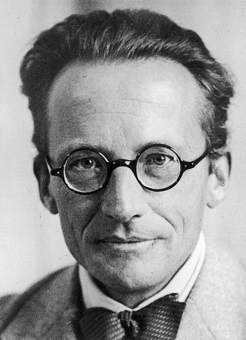

# Erwin Schrödinger (1887–1961)

  
  
<em>Erwin Schrödinger (1887–1961)</em>

## Overview

Erwin Rudolf Josef Alexander Schrödinger was an Austrian physicist who formulated the wave equation at the heart of quantum mechanics — the Schrödinger equation — and proposed the famous thought experiment of "Schrödinger's cat" that continues to illuminate the interpretive puzzles of quantum theory. His 1926 wave mechanics provided an alternative (and ultimately equivalent) formulation to Heisenberg's matrix mechanics, and its continuous, intuitive wave picture made quantum mechanics accessible to a vastly wider audience. He shared the Nobel Prize in Physics in 1933 with Paul Dirac.

## Early Life and Education

Schrödinger was born on 12 August 1887 in Vienna, Austria, into a comfortable, intellectually stimulating household. His father, Rudolf Schrödinger, was a botanist and painter; his maternal grandfather was the chemist Alexander Bauer. He was educated privately and at home until entering the Akademisches Gymnasium in Vienna, where he excelled in mathematics, physics, and Latin. He then studied physics at the University of Vienna, receiving his doctorate in 1910 under Fritz Hasenöhrl.

After military service in World War I (he served as an artillery officer), Schrödinger worked in Jena, Stuttgart, Breslau, and Zurich, where he became professor of theoretical physics in 1921. His career up to 1926 was solid but not spectacular; his great breakthrough came suddenly and with extraordinary productivity.

## The Schrödinger Equation

In late 1925, stimulated by de Broglie's matter wave hypothesis and Einstein's enthusiastic response to it, Schrödinger set out to write a proper wave equation for de Broglie's matter waves. He worked intensely over Christmas and New Year 1925–1926, reportedly at a mountain retreat in Arosa, Switzerland.

The result — the **Schrödinger equation** — appeared in a series of four papers published in *Annalen der Physik* in early 1926:

**iℏ ∂ψ/∂t = Ĥψ**

where ψ is the wave function of the quantum system, Ĥ is the Hamiltonian operator (encoding the system's energy), and ℏ is the reduced Planck constant. For the stationary states of the hydrogen atom, the time-independent version gives:

**Ĥψ = Eψ**

an eigenvalue equation whose solutions give the discrete energy levels of hydrogen — reproducing the Bohr model from first principles, and extending naturally beyond it to multi-electron atoms and molecules.

Unlike Heisenberg's matrix mechanics, which operated with discrete arrays of numbers and was mathematically unfamiliar even to physicists, Schrödinger's equation was a partial differential equation — a mathematical form physicists were completely comfortable with. Wave mechanics spread rapidly. In his papers Schrödinger also proved that wave mechanics and matrix mechanics are mathematically equivalent — both are representations of the same underlying theory.

## The Interpretation of ψ

Schrödinger initially interpreted the wave function ψ as a real physical wave — the electron genuinely spread in space. He was deeply unhappy with Max Born's probabilistic interpretation (|ψ|² gives the probability density of finding the particle at a given location), which was rapidly accepted by the physics community. Schrödinger argued to the end that quantum mechanics was incomplete and that a physical wave picture should eventually replace the probabilistic interpretation.

## Schrödinger's Cat

In 1935, responding to the Einstein-Podolsky-Rosen paper, Schrödinger introduced his famous thought experiment. Imagine a cat in a sealed box with a radioactive atom, a detector, and a vial of poison. If the atom decays, the detector triggers a mechanism that breaks the vial, killing the cat. Quantum mechanics says that until observed, the atom exists in a superposition of decayed and not-decayed states. The cat is therefore — until the box is opened — in a superposition of alive and dead.

The thought experiment was intended as a reductio ad absurdum: Schrödinger was arguing that the Copenhagen interpretation, applied literally to macroscopic objects, produces nonsense. The cat cannot be both alive and dead. Ironically, the thought experiment became an icon of quantum weirdness rather than a refutation of it, and continues to motivate research into quantum decoherence, the measurement problem, and the many-worlds interpretation.

## What Is Life?

In 1944 Schrödinger published *What Is Life?*, a short book based on lectures delivered in Dublin. In it he argued that genes must be "aperiodic crystals" — molecules complex enough to encode the hereditary information of a living organism. He suggested that quantum mechanical stability explains why genetic information is transmitted faithfully across generations without dissolving in thermal noise. The book directly inspired Francis Crick and James Watson, who credited it with drawing them to the problem of the structure of DNA. *What Is Life?* may be the most influential physics book ever written in terms of direct impact on another field.

## Exile and Later Life

In 1927 Schrödinger succeeded Planck in the prestigious Chair of Theoretical Physics at the University of Berlin. When Hitler came to power in 1933, Schrödinger — not Jewish but opposed to Nazism — voluntarily left Germany. He went briefly to Oxford and then to the newly founded Dublin Institute for Advanced Studies, where Éamon de Valera invited him to create and direct the School of Theoretical Physics. He remained in Dublin for seventeen productive years before returning to Vienna in 1956, where he died on 4 January 1961.

## Legacy

The Schrödinger equation is the central equation of non-relativistic quantum mechanics and is used daily in atomic physics, chemistry, condensed matter physics, and biology. Schrödinger's cat remains the most widely known symbol of quantum weirdness. His *What Is Life?* contributed to the founding of molecular biology.

## Key Works

- "Quantisierung als Eigenwertproblem" (four papers, 1926) — wave mechanics
- "Über das Verhältnis der Heisenberg-Born-Jordanschen Quantenmechanik zu der meinen" (1926) — equivalence of wave and matrix mechanics
- "Die gegenwärtige Situation in der Quantenmechanik" (1935) — Schrödinger's cat
- *What Is Life?* (1944)
