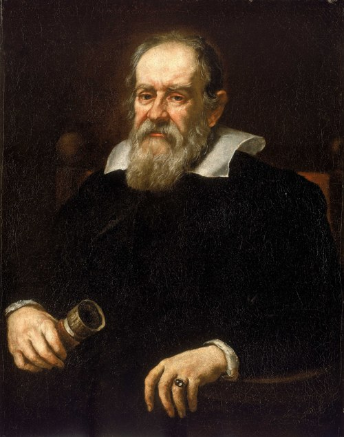

# Galileo Galilei (1564–1642)

  
  
<em>Galileo Galilei (1564–1642)</em>

## Overview

Galileo Galilei was an Italian astronomer, physicist, and mathematician whose work during the late sixteenth and early seventeenth centuries laid the foundation for modern observational astronomy and classical mechanics. Often called the "father of modern science," Galileo championed the empirical method at a time when natural philosophy was still largely dominated by Aristotelian doctrine and scholastic tradition. His willingness to let experiment and observation override received authority brought him into direct conflict with the Catholic Church — a conflict that became one of the most celebrated episodes in the history of science.

## Early Life and Education

Born on 15 February 1564 in Pisa, in the Grand Duchy of Tuscany, Galileo was the eldest child of Vincenzo Galilei, a lutenist and music theorist, and Giulia degli Ammannati. His father's rigorous approach to testing musical theory empirically may have influenced Galileo's own instinct for measurement and experiment. At seventeen, Galileo enrolled at the University of Pisa to study medicine, but his passion quickly shifted to mathematics and natural philosophy. He left without completing his degree, yet secured a teaching position in mathematics at Pisa in 1589 and at Padua in 1592, where he would remain for eighteen productive years.

## Mechanics and the Science of Motion

At Pisa and Padua, Galileo conducted systematic studies of motion that overturned centuries of Aristotelian physics. Aristotle had claimed that heavier objects fall faster than lighter ones; Galileo, through inclined-plane experiments and careful timing, demonstrated that — ignoring air resistance — all objects accelerate at the same rate under gravity. He formulated what is now called the law of uniform acceleration: the distance traveled by a freely falling body is proportional to the square of the elapsed time.

He also articulated an early version of the principle of inertia — that a body moving on a frictionless horizontal surface would continue moving indefinitely — anticipating Newton's first law of motion. His analysis of projectile motion showed that such trajectories are parabolic, uniting horizontal uniform motion with vertical acceleration. These insights were later collected in his masterwork *Discorsi e Dimostrazioni Matematiche intorno a Due Nuove Scienze* (1638), written while he was under house arrest.

## Telescopic Astronomy

In 1609 Galileo heard reports of a Dutch instrument that made distant objects appear closer. He quickly constructed his own telescope, surpassing the Dutch models, and turned it toward the sky with transformative results. His observations, published in *Sidereus Nuncius* (The Starry Messenger, 1610), included:

- **The Moon's surface**: Rather than a perfect, smooth sphere as Aristotle taught, the Moon was rugged, mountainous, and pocked with craters.
- **The Milky Way**: Resolved into vast numbers of individual stars invisible to the naked eye.
- **Four moons of Jupiter**: Now called the Galilean moons — Io, Europa, Ganymede, and Callisto — their orbits around Jupiter demonstrated that not everything in the cosmos revolved around Earth.
- **Phases of Venus**: Showing that Venus circles the Sun, not Earth — evidence incompatible with the Ptolemaic geocentric model.
- **Sunspots**: Indicating that the Sun itself was imperfect and rotating.

These discoveries provided powerful support for the heliocentric model championed by Copernicus.

## The Conflict with the Church

Galileo's advocacy for Copernicanism drew increasing scrutiny from Church authorities. In 1616 the Inquisition declared heliocentrism formally heretical, and Galileo was instructed not to hold or defend the doctrine. He largely complied for over a decade, but in 1632 he published *Dialogo sopra i due massimi sistemi del mondo* (Dialogue Concerning the Two Chief World Systems), which presented a thinly veiled argument in favor of Copernicus. The book infuriated Pope Urban VIII — once a personal friend — who felt Galileo had put his own arguments into the mouth of a simpleton character named Simplicio.

Summoned before the Roman Inquisition in 1633, Galileo was found "vehemently suspected of heresy" and compelled to formally abjure his Copernican views. He was sentenced to house arrest at his villa in Arcetri, near Florence, where he spent the remainder of his life. The famous legend that he muttered "And yet it moves" after his recantation has no contemporary evidence, but captures the spirit of his conviction.

## Later Work and Legacy

Despite blindness in his final years, Galileo continued to think and dictate. *Two New Sciences* (1638), smuggled out of Italy and published in Leiden, summarized his life's work in mechanics and is widely regarded as the first modern physics textbook. He died on 8 January 1642.

Galileo's legacy is immense. He demonstrated that mathematics is the language of nature, that observation must trump authority, and that celestial and terrestrial physics obey the same laws. Isaac Newton, born the year Galileo died, built his mechanics directly on Galilean foundations. The Catholic Church officially rehabilitated Galileo in 1992, when Pope John Paul II acknowledged that Church officials had erred.

## Key Works

- *Sidereus Nuncius* (The Starry Messenger, 1610)
- *Dialogo sopra i due massimi sistemi del mondo* (Dialogue Concerning the Two Chief World Systems, 1632)
- *Discorsi e Dimostrazioni Matematiche intorno a Due Nuove Scienze* (Two New Sciences, 1638)
