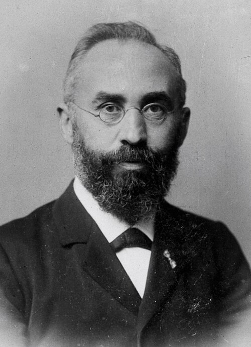

# Hendrik Lorentz (1853–1928)

  
  
<em>Hendrik Lorentz (1853–1928)</em>

## Overview

Hendrik Antoon Lorentz was a Dutch theoretical physicist who built the classical electron theory and derived the Lorentz transformation — the mathematical relationships between space and time measurements in different inertial frames that Einstein later incorporated into special relativity. A figure of enormous personal authority in European physics, Lorentz was the first chairman of the celebrated Solvay Conferences and was universally admired by contemporaries including Einstein, who called him "the greatest and noblest man I have ever known."

## Early Life and Education

Lorentz was born on 18 July 1853 in Arnhem, Netherlands. He was a brilliant student, completing his secondary education with distinction and enrolling at the University of Leiden at seventeen. He completed his bachelor's degree in two years, then returned to Arnhem to teach night school while writing his doctoral dissertation, which he defended at Leiden in 1875 at twenty-one. The dissertation refined and extended Maxwell's electromagnetic theory to account for the reflection and refraction of light — an early indication of his lifelong project of connecting Maxwell's field theory with a theory of matter.

At twenty-four he was appointed to the Chair of Theoretical Physics at Leiden — the first such chair in the Netherlands — a position he held for thirty-five years. He was known as an exceptionally clear teacher and a remarkably generous colleague.

## The Electron Theory and the Lorentz Force

In the 1890s Lorentz developed a comprehensive electron theory of matter: the idea that matter consists of charged particles (electrons) embedded in Maxwell's electromagnetic field. This framework allowed him to explain a wide range of optical and electromagnetic phenomena.

The central result is the **Lorentz force law**: the force on a charged particle moving through electric and magnetic fields is F = q(E + v × B). Though the components of this formula were known before Lorentz, he assembled them into this precise, comprehensive form. It remains one of the fundamental equations of classical electrodynamics.

Using his electron theory, Lorentz explained the Zeeman effect — the splitting of spectral lines in a magnetic field — discovered by his student Pieter Zeeman in 1896. The quantitative agreement between Lorentz's theory and Zeeman's measurements earned both men the Nobel Prize in Physics in 1902.

## The Lorentz Transformation and the Approach to Relativity

The greatest challenge facing electrodynamics in the 1890s was the expected detection of Earth's motion through the aether — the hypothetical medium through which electromagnetic waves were supposed to propagate. Michelson and Morley's famous 1887 experiment found no such motion. Lorentz (and independently, Irish physicist George FitzGerald) proposed that objects moving through the aether physically contract in the direction of motion by exactly the factor needed to explain the null result — the FitzGerald-Lorentz contraction.

Lorentz developed this thinking into a complete set of coordinate transformations in his 1904 paper, introducing what Poincaré named the **Lorentz transformations**: the equations relating space and time coordinates between two frames in relative motion. These transformations leave Maxwell's equations invariant, preserve the speed of light, and mathematically encompass time dilation and length contraction.

In 1905 Einstein used the same transformations as the mathematical core of special relativity — but interpreted them fundamentally differently. For Lorentz, the transformations described real physical distortions of rods and clocks due to motion through the aether; for Einstein, they expressed a new geometry of space-time with no aether required. Lorentz never fully accepted Einstein's interpretation, remaining attached to the aether concept even while acknowledging that his own theory gave incorrect empirical predictions without Einstein's principles. The relationship between Lorentz's and Einstein's theories illustrates how the same mathematics can be embedded in radically different physical interpretations.

## The Solvay Conferences

In 1911 the Belgian industrialist Ernest Solvay funded the first of a series of invitation-only physics conferences in Brussels. Lorentz was chosen to chair them, a role he performed with such skill and impartiality — translating fluidly among French, German, and English, summarizing discussions with precision and tact — that he became one of the defining figures of early-twentieth-century physics diplomacy. The 1927 Solvay Conference, which he presided over, brought together the architects of quantum mechanics — Bohr, Heisenberg, Schrödinger, Pauli, Dirac, Einstein, and others — for what has been called the greatest meeting of minds in physics history.

## Later Career and Zuider Zee

After retiring from Leiden in 1912, Lorentz became director of research at the Teylers Museum in Haarlem and continued to work and lecture. One of his most remarkable non-physics achievements was heading the Dutch government commission that calculated the effects of closing the Zuider Zee (now IJsselmeer) on tidal patterns in the North Sea — a purely hydrodynamic problem requiring the same mathematical machinery he used in physics. His calculations proved accurate.

Lorentz died of erysipelas on 4 February 1928 in Haarlem. At his funeral, Einstein delivered a memorial address that concluded: "He shaped his life like an exquisite work of art down to its very last moment."

## Legacy

The Lorentz force law, the Lorentz transformation, the Lorentz factor γ = 1/√(1−v²/c²), and the Lorentz group of relativity all bear his name. Though special relativity belongs conceptually to Einstein, its mathematical structure was largely in place in Lorentz's work, making him an indispensable transitional figure between classical and modern physics.

## Key Works

- "La théorie électromagnétique de Maxwell et son application aux corps mouvants" (1892)
- "Versuch einer Theorie der electrischen und optischen Erscheinungen in bewegten Körpern" (1895)
- "Electromagnetic phenomena in a system moving with any velocity smaller than that of light" (1904)
- *The Theory of Electrons* (1909)
