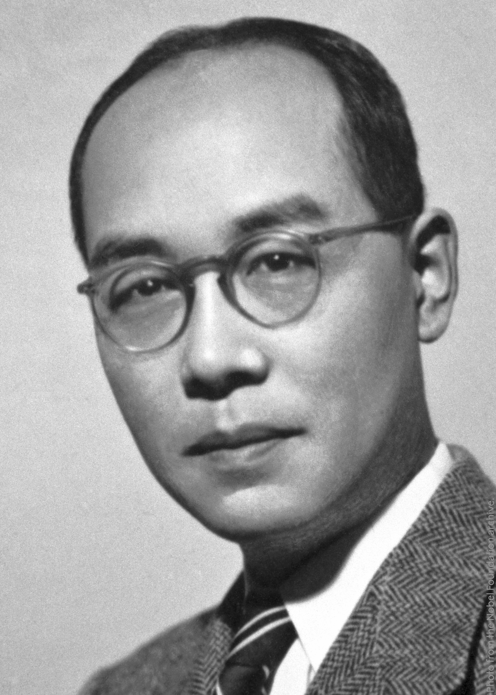

# Hideki Yukawa (1907–1981)

  
  
<em>Hideki Yukawa (1907–1981)</em>

## Overview

Hideki Yukawa was a Japanese theoretical physicist who in 1935 predicted the existence of a new particle — the meson — as the carrier of the strong nuclear force that holds atomic nuclei together. Discovered experimentally twelve years later, the pion (the lightest meson) was the first elementary particle predicted purely on theoretical grounds before its experimental detection. Yukawa received the Nobel Prize in Physics in 1949, becoming the first Japanese Nobel laureate in science. His work founded the modern understanding of nuclear forces in terms of particle exchange and pointed toward the field of particle physics.

## Early Life and Education

Yukawa was born on 23 January 1907 in Tokyo, Japan, the fifth child of Takuji Ogawa, a geologist and later a professor at Kyoto University. The family moved to Kyoto when Yukawa was two. Growing up in a scholarly household, Yukawa developed an early love of reading — both classical Chinese literature and Western science. He enrolled at Kyoto Imperial University in 1926 and graduated in 1929 with a degree in physics.

Unable to find a position in Tokyo, he remained in Kyoto as an unpaid assistant at the university, working independently on theoretical physics. He married Sumi Yukawa in 1932 (adopting her family name, Yukawa, as was customary in Japan when a family had no male heir to carry the name). In 1933 he moved to Osaka Imperial University and then returned to Kyoto as an associate professor in 1936.

## The Meson Theory of Nuclear Forces

The central puzzle of nuclear physics in the early 1930s was the nature of the force that holds atomic nuclei together. The protons in a nucleus should repel each other violently by electrostatic force; some other, stronger force must overcome this repulsion at short range.

Working from an analogy with electromagnetism — where photons mediate the electromagnetic force — Yukawa proposed that nuclear forces are mediated by a new particle. The key mathematical constraint was the range of the force: nuclear forces act only over distances of about 10⁻¹⁵ meters (one femtometer), whereas electromagnetic forces have infinite range.

In quantum field theory, the range of a force mediated by a particle of mass m is approximately ℏ/(mc) — the Compton wavelength of the mediating particle. For photons (massless), this gives infinite range. For a nuclear force with range ~2 fm, Yukawa calculated the mediating particle must have a mass of roughly 200 times the electron mass — about one-tenth the proton mass, intermediate between the electron and the proton. He called the predicted particle the "mesotron," later shortened to meson.

This prediction, published in 1935, was the founding act of meson physics and of the broader programme of explaining forces through the exchange of virtual particles — the core idea of quantum field theory.

## Experimental Confirmation

In 1936 Carl Anderson and Seth Neddermeyer discovered a particle in cosmic rays with the expected mass. For a decade it was assumed to be Yukawa's particle. But the cosmic ray particle — later named the muon — interacted only weakly with nuclei, inconsistent with what a nuclear force carrier should do.

The true Yukawa particle — the pion — was discovered in 1947 by Cecil Powell using photographic emulsions to detect cosmic rays at high altitude. The pion has a mass of about 270 electron masses and interacts strongly with nuclei, exactly as Yukawa had predicted. Powell received the Nobel Prize in Physics in 1950 for this discovery. Yukawa had received his in 1949.

## Broader Contributions and Philosophy

Yukawa continued to work on theoretical physics throughout his career, exploring the nature of elementary particles, non-local field theories, and the foundations of quantum mechanics. He was interested in the philosophical implications of physics and wrote about the relationship between science and Eastern philosophy. He was critical of the increasingly abstract direction of particle physics in later years.

He was a vocal pacifist and disarmament advocate, signing the Russell-Einstein Manifesto in 1955 and participating in the Pugwash Conferences. Japan's experience of atomic bombing gave his pacifism particular moral weight.

In 1953 Yukawa became director of the Research Institute for Fundamental Physics (now the Yukawa Institute for Theoretical Physics) at Kyoto University. He retired in 1970 and died on 8 September 1981 in Kyoto.

## Legacy

Yukawa's meson theory established the paradigm for understanding fundamental forces through particle exchange — the paradigm that underpins the Standard Model. While the pion is not the fundamental carrier of the strong force (that role belongs to gluons in quantum chromodynamics), Yukawa's idea that nucleon interactions arise from meson exchange remains an effective description of nuclear forces at low energies. The Yukawa potential — the screened Coulomb potential of the form e^(-r/R)/r — appears throughout nuclear physics, condensed matter physics, and plasma physics. Element 119, oganesson's predicted successor, has been provisionally named "yukawanium" in some proposals, though this is not official.

## Key Works

- "On the Interaction of Elementary Particles I" (1935) — the meson prediction
- "On the Interaction of Elementary Particles II" (with Sakata, 1937)
- *Introduction to Quantum Mechanics* (1946)
- *Creativity and Intuition* (philosophical essays, 1973)
