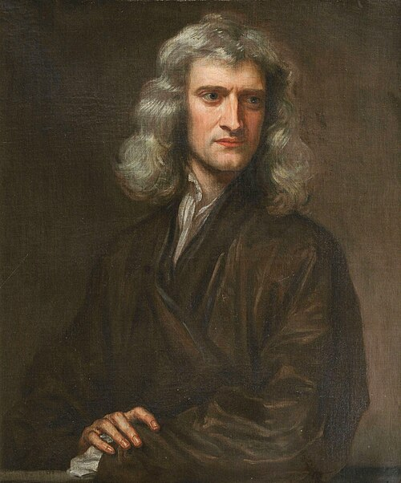

# Isaac Newton (1643–1727)

  
  
<em>Isaac Newton (1643–1727)</em>

## Overview

Isaac Newton was an English mathematician, physicist, astronomer, and natural philosopher whose *Principia Mathematica* (1687) unified terrestrial and celestial mechanics under a single set of laws, and whose development of calculus provided the mathematical engine for centuries of scientific progress. He is widely regarded as one of the most influential scientists in history — a figure whose synthesis of observation, mathematics, and physical law defined the scientific enterprise for over two hundred years.

## Early Life and Education

Newton was born prematurely on 25 December 1642 (Old Style; 4 January 1643 New Style) in Woolsthorpe-by-Colsterworth, Lincolnshire, England. His father died three months before his birth, and his mother remarried when Newton was three, leaving him to be raised by his maternal grandmother. The emotional isolation of his childhood may have contributed to the intense, solitary focus that characterized his intellectual life.

He attended The King's School in Grantham before enrolling at Trinity College, Cambridge, in 1661. Cambridge still taught largely Aristotelian philosophy, but Newton independently devoured the works of Descartes, Galileo, Kepler, and Wallis. When the university closed in 1665–1666 due to plague, Newton retreated to Woolsthorpe. In those extraordinary "miracle years" he developed the foundations of calculus (which he called the "method of fluxions"), formulated his theory of universal gravitation, and discovered that white light is a mixture of colors — arguably the most productive eighteen months in the history of science.

## Mathematics: The Calculus

Newton developed calculus independently of — and roughly simultaneously with — Gottfried Wilhelm Leibniz. Newton's formulation used the concept of "fluxions" (rates of change) and "fluents" (quantities that flow with time), while Leibniz developed the notation (∫, d/dx) that we use today. The priority dispute between their supporters became one of the bitterest controversies in mathematical history, though modern historians credit both men with independent discovery. Newton's calculus underpinned his mechanical proofs in the *Principia* and remains foundational to physics and engineering.

## Optics

Newton demonstrated through prism experiments that sunlight, apparently white, is composed of a spectrum of colors that can be separated and recombined. He built the first practical reflecting telescope in 1668, using a curved mirror to avoid the chromatic aberration that plagued lens-based instruments of the era. His optical findings were published in *Opticks* (1704), written in English (unlike the Latin *Principia*) and accessible to a wider audience. He also developed the "corpuscular" theory of light — that light consists of particles — which dominated thinking until the wave theory of Young and Fresnel in the nineteenth century.

## Universal Gravitation and the *Principia*

Newton's supreme achievement was the *Philosophiæ Naturalis Principia Mathematica* (Mathematical Principles of Natural Philosophy, 1687), published at the urging and financial support of astronomer Edmond Halley. In this work Newton:

- **Defined the three laws of motion**: inertia, F = ma, and action-reaction.
- **Formulated the law of universal gravitation**: every mass attracts every other mass with a force proportional to the product of their masses and inversely proportional to the square of the distance between them.
- **Demonstrated that this single law explains** the orbits of planets (Kepler's laws), the trajectory of comets, the motion of the Moon, the behavior of tides, and the fall of objects near Earth's surface.

The unification of celestial and terrestrial physics under a single mathematical framework was revolutionary. It showed that the universe is governed by discoverable, rational laws — a founding premise of Enlightenment thought.

## Other Contributions

Newton's intellectual range was extraordinary. He served as Warden and later Master of the Royal Mint (1696–1727), overseeing a major currency recoinage. He was President of the Royal Society from 1703 until his death. He also spent enormous energy on alchemy and biblical chronology — pursuits now considered outside science but which he took with complete seriousness. His alchemical manuscripts, largely unpublished in his lifetime, number in the millions of words.

## Character and Later Life

Newton was famously difficult: secretive, prone to feuds (with Hooke, Flamsteed, and Leibniz among others), and capable of vindictiveness toward rivals. He never married and seems to have had few close relationships. Yet he was capable of deep loyalty to protégés and could be generous when not threatened.

He died on 20 March 1727 in Kensington, London, and was buried with great ceremony in Westminster Abbey. The poet Alexander Pope captured his era's awe: *"Nature and Nature's laws lay hid in night: God said, Let Newton be! and all was light."*

## Legacy

Newton's mechanics remained the unchallenged framework of physics until Einstein's relativity (1905, 1915) and quantum mechanics revealed its limits at extreme scales. Yet Newtonian mechanics remains entirely adequate — and the tool of choice — for the vast majority of engineering and everyday physics. His method of combining rigorous mathematics with empirical observation remains the model of physical science.

## Key Works

- *Philosophiæ Naturalis Principia Mathematica* (1687)
- *Opticks* (1704)
- *Method of Fluxions* (written c. 1671, published 1736)
