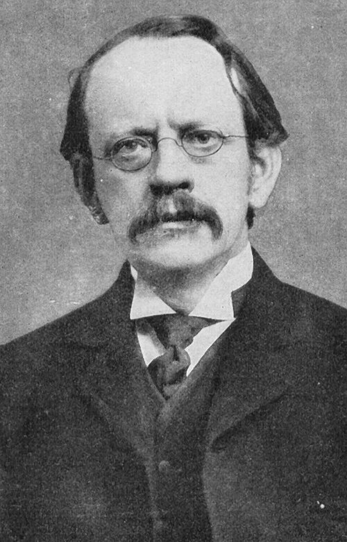

# J.J. Thomson — Joseph John Thomson (1856–1940)

  
  
<em>J.J. Thomson — Joseph John Thomson (1856–1940)</em>

## Overview

Joseph John Thomson was a British physicist who discovered the electron in 1897 — the first subatomic particle ever identified, and the discovery that shattered the Victorian conception of the indivisible atom. As Cavendish Professor at Cambridge and director of the Cavendish Laboratory, he trained a generation of physicists who collectively won a remarkable eight Nobel Prizes. Thomson himself received the Nobel Prize in Physics in 1906 "in recognition of the great merits of his theoretical and experimental investigations on the conduction of electricity by gases."

## Early Life and Education

Thomson was born on 18 December 1856 in Cheetham Hill, Manchester, England. His father, a bookseller, intended him for an engineering apprenticeship, but died when Thomson was sixteen, leaving insufficient funds. Thomson obtained a scholarship to Owens College, Manchester (later the University of Manchester), where he came under the influence of the physicist Balfour Stewart. In 1876 he won a scholarship to Trinity College, Cambridge, where he spent the rest of his professional life. He graduated as Second Wrangler in the Mathematical Tripos in 1880 (Ernest Rutherford would later become one of his most famous students) and was elected a Fellow of Trinity College.

In 1884, at twenty-seven — an unusually young age — he was appointed Cavendish Professor of Experimental Physics and director of the Cavendish Laboratory, succeeding Lord Rayleigh. He held the position until 1919.

## Discovery of the Electron

The critical experiments took place in 1897 using cathode rays — the mysterious rays produced when electric current is passed through an evacuated glass tube. The nature of cathode rays was bitterly disputed: German physicists generally believed they were waves, while British physicists suspected they were streams of charged particles.

Thomson subjected cathode rays to both electric and magnetic fields and measured the deflection of the rays. By balancing the two forces, he could determine the ratio of charge to mass (e/m) of the particles constituting the rays. His key findings were:

1. The rays were deflected by electric fields — they were charged particles, not waves.
2. The e/m ratio was the same regardless of the electrode material or the gas in the tube.
3. The e/m ratio was about 1,800 times larger than for hydrogen ions (the lightest known particles).

Thomson concluded that cathode rays consist of particles far smaller and lighter than any atom — particles he initially called "corpuscles," later named *electrons* by others. In his famous 1897 paper he proposed that these particles are constituents of all matter. This was the first experimental evidence that atoms have internal structure — overturning two millennia of indivisible-atom theory.

Thomson followed this by measuring the charge of the electron by observing droplets of electrified water vapor in a magnetic field — a technique later perfected by Robert Millikan. Combined with the e/m ratio, this gave the first estimate of electron mass.

## The Plum Pudding Model

Having established that atoms contain electrons, Thomson proposed the "plum pudding" model of atomic structure (1904): the atom consists of a sphere of diffuse positive charge in which electrons are embedded like raisins in a pudding. The model was consistent with all evidence available at the time, though it was overturned by Rutherford's gold foil experiment in 1909–1911, which revealed that positive charge is concentrated in a tiny nucleus.

## Positive Rays and Isotopes

Thomson was also a pioneer in mass spectrometry. Studying positive rays (streams of positive ions moving in the opposite direction from cathode rays), he and his assistant Francis Aston built instruments to measure the mass-to-charge ratios of positive ions. In 1913 Thomson obtained evidence that neon consisted of two types of atoms with different masses — what we now call isotopes. This was the first demonstration of isotopes in a stable (non-radioactive) element. Aston developed the technique into the mass spectrograph, won the Nobel Prize in Chemistry in 1922, and dedicated his prize lecture to Thomson.

## The Cavendish Laboratory and Teaching

Thomson's most lasting institutional legacy was the Cavendish Laboratory under his directorship. Among those who worked or studied there during his tenure were Ernest Rutherford (Nobel 1908), Charles Glover Barkla (Nobel 1917), Max von Laue (Nobel 1914), William Henry Bragg, Francis Aston (Nobel 1922), and Owen Richardson (Nobel 1928). His son George Paget Thomson later discovered electron diffraction and shared the Nobel Prize in Physics in 1937 — the only case of a father and son each winning a Nobel Prize in the same discipline for related work (the father proved electrons are particles; the son proved they are waves).

## Later Life

Thomson was knighted in 1908, appointed to the Order of Merit in 1912, and served as President of the Royal Society from 1915 to 1920. He remained at Cambridge as Master of Trinity College from 1918 until his death, continuing to work in his laboratory. He died on 30 August 1940 and is buried in Westminster Abbey, near Newton and Darwin.

## Legacy

The discovery of the electron is the founding event of modern particle physics and atomic physics. Every device that uses electrons — cathode ray tubes, vacuum tubes, transistors, electron microscopes, particle accelerators — descends from Thomson's 1897 experiments.

## Key Works

- "Cathode Rays" (1897) — the discovery paper
- "On the Structure of the Atom" (1904) — the plum pudding model
- *Conduction of Electricity through Gases* (1903)
- *Rays of Positive Electricity and Their Application to Chemical Analysis* (1913)
