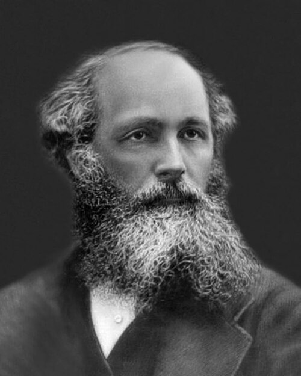

# James Clerk Maxwell (1831–1879)

  
  
<em>James Clerk Maxwell (1831–1879)</em>

## Overview

James Clerk Maxwell was a Scottish physicist and mathematician whose four equations of electromagnetism stand as one of the greatest achievements in the history of science. By unifying electricity, magnetism, and light into a single theoretical framework, Maxwell accomplished for the electromagnetic field what Newton had accomplished for mechanics. Richard Feynman remarked that Maxwell's equations would surely be judged by future historians as the most significant event of the nineteenth century. Einstein considered his own work a direct extension of Maxwell's.

## Early Life and Education

Maxwell was born on 13 June 1831 in Edinburgh, Scotland, into a prosperous family. His father, John Clerk Maxwell, was a lawyer with broad intellectual interests who took an active role in his son's education. Maxwell's mother died of abdominal cancer when he was eight — a loss that shaped his quiet, contemplative personality.

He showed unusual intellectual precocity: at fourteen he submitted a paper on a geometric method for drawing perfect oval curves to the Royal Society of Edinburgh. He studied at the University of Edinburgh before transferring to Trinity College, Cambridge, where he graduated as Second Wrangler in the Mathematical Tripos in 1854 (the top student, Edward Routh, was barely his superior). He was elected a fellow of Trinity and then took a professorship at Marischal College, Aberdeen, in 1856. After a stint at King's College London, he retired to his family estate in Glenlair, Scotland. In 1871 he was appointed the first Cavendish Professor of Physics at Cambridge, where he designed and oversaw the construction of the Cavendish Laboratory.

## The Theory of Electromagnetism

Maxwell's supreme contribution was synthesizing the experimental discoveries of Faraday, Ampère, and others into a unified mathematical theory. Working through the 1860s, he published a series of papers culminating in *A Treatise on Electricity and Magnetism* (1873).

His central innovation was the displacement current — a correction to Ampère's law positing that a changing electric field generates a magnetic field even in the absence of moving charges. This seemingly technical amendment had enormous consequences: it made the equations internally consistent and predicted the existence of electromagnetic waves. Calculating the predicted speed of these waves from purely electrical measurements, Maxwell found it equal — to within experimental error — to the measured speed of light. His conclusion was stunning: *light itself is an electromagnetic wave.*

Maxwell's four equations (in their modern, compact form using vector calculus) relate:
1. Electric charges to the electric fields they produce (Gauss's law)
2. The absence of magnetic monopoles
3. Changing magnetic fields to electric fields (Faraday's law)
4. Electric currents and changing electric fields to magnetic fields (Ampère-Maxwell law)

These four equations encode all of classical electrodynamics. Every radio signal, microwave oven, optical fiber, and wireless network operates according to Maxwell's equations.

## Kinetic Theory of Gases and Statistical Mechanics

Independently of Boltzmann, Maxwell developed the kinetic theory of gases. In 1860 he derived the Maxwell distribution — the statistical distribution of molecular speeds in a gas at thermal equilibrium. This was the first time a probability distribution was used in physics to describe a physical quantity at the molecular level, inaugurating statistical mechanics. His concept of "Maxwell's demon" — a hypothetical being that could sort molecules by speed without doing work, apparently violating the second law of thermodynamics — sparked a century of debate about the relationship between thermodynamics, information, and entropy that is still unresolved in some philosophical respects.

## Color Vision and Photography

Maxwell made foundational contributions to the science of color perception. He demonstrated that human color vision is trichromatic — based on three types of receptors corresponding to red, green, and blue — and devised the first color photograph in 1861. Taking three photographs of a tartan ribbon through red, green, and blue filters and projecting them simultaneously, he produced the first color photograph in history. His color triangle, representing the gamut of colors mixable from three primaries, is a precursor to modern colorimetry and the RGB color model.

## Saturn's Rings

In 1857, responding to a prize question from Cambridge, Maxwell proved analytically that Saturn's rings could not be solid or liquid, and must consist of many independently orbiting particles — confirmed by the Voyager space probes more than a century later. The Adams Prize essay on this subject remains a masterpiece of mathematical physics applied to astronomy.

## Character and Death

Maxwell was known for his warmth, wit, and deep Christian faith. He was enormously well-read and wrote poetry throughout his life. He died of abdominal cancer on 5 November 1879, at forty-eight — the same age his mother had been when she died of the same disease. Had he lived another decade, he might have been the one to discover the electron and formulate relativity.

## Legacy

The maxwell (Mx), a unit of magnetic flux in the CGS system, is named in his honor. Einstein called Maxwell's work "the most profound and the most fruitful that physics has experienced since Newton." His equations predicted radio waves, which Heinrich Hertz confirmed experimentally in 1887, nine years after Maxwell's death. Every aspect of modern technology involving electromagnetic radiation traces directly to Maxwell's theoretical synthesis.

## Key Works

- "On Faraday's Lines of Force" (1856)
- "On Physical Lines of Force" (1861–62)
- "A Dynamical Theory of the Electromagnetic Field" (1865)
- *A Treatise on Electricity and Magnetism* (1873)
