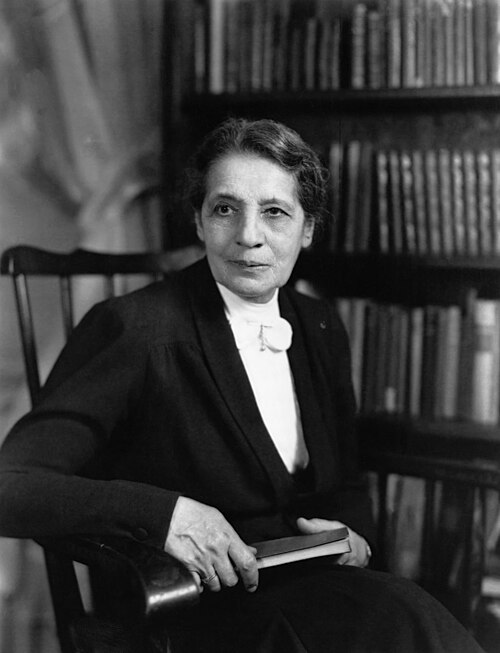

# Lise Meitner (1878–1968)

  
  
<em>Lise Meitner (1878–1968)</em>

## Overview

Lise Meitner was an Austrian-Swedish physicist who co-discovered nuclear fission and provided its first theoretical explanation — one of the most consequential scientific discoveries of the twentieth century, enabling both nuclear power and nuclear weapons. Despite her central role, she was excluded from the Nobel Prize awarded to her long-time collaborator Otto Hahn, a decision that remains one of the most debated injustices in Nobel Prize history. Throughout her career she faced systematic discrimination as both a woman and a Jew, yet persisted to become one of the most important nuclear physicists of her era.

## Early Life and Education

Meitner was born on 7 November 1878 in Vienna, Austria, into a secular Jewish family. Her father, Philipp Meitner, was a lawyer; her mother, Hedwig Skovran, encouraged intellectual independence in all her eight children. Because Austrian universities were closed to women until 1897, Meitner had to be educated privately before she could enroll. She passed her university entrance examination in 1901 and enrolled in the University of Vienna, where she studied physics under Ludwig Boltzmann — an experience she described as transformative.

She received her doctorate in physics in 1906, only the second woman to earn a physics doctorate from Vienna. Determined to work in theoretical physics, she traveled to Berlin in 1907 to attend lectures by Max Planck (who initially assumed, from her name, that she was male) and to work in his institute.

## The Meitner-Hahn Partnership

At the Chemical Institute of the University of Berlin, Meitner began a collaboration with the chemist Otto Hahn that would last thirty years. Initially Meitner was confined to the basement — women were barred from the main institute building. The restriction was lifted when Prussia opened its universities fully to women in 1909.

Together, Meitner and Hahn made numerous discoveries in nuclear physics and radiochemistry over the following decades. They developed novel methods for separating radioactive isotopes, discovered the element protactinium (element 91) in 1917, and contributed extensively to understanding the beta-decay process. Meitner was the physicist, responsible for theoretical interpretation; Hahn was the chemist, responsible for the radiochemical separations — a division of labor that would have crucial consequences for her Nobel recognition.

In 1926 Meitner became the first woman to hold a full professorship in physics in Germany, appointed at the University of Berlin. She also headed the physics department at the Kaiser Wilhelm Institute for Chemistry.

## Discovery of Nuclear Fission

By the mid-1930s, physicists across Europe were bombarding uranium with neutrons, hoping to produce elements heavier than uranium. Meitner, Hahn, and their younger colleague Fritz Strassmann formed a new team. Then, in 1938, the political situation became catastrophic.

When Germany annexed Austria in March 1938, Meitner lost her Austrian citizenship and became subject to Nazi racial laws. She was German Jewish — the threat was existential. Dutch colleagues organized a secret escape in July 1938: Meitner crossed into the Netherlands with ten marks and some diamond rings, eventually settling in Stockholm to work at the Nobel Institute under Manne Siegbahn. The transition was difficult; Siegbahn gave her minimal support and she was initially isolated.

In December 1938, Hahn and Strassmann performed an experiment in Berlin that produced a barium residue when uranium was bombarded with neutrons. They wrote to Meitner, bewildered: barium has less than half the mass of uranium — how could it be a product? Over Christmas 1938, walking in the snow with her nephew Otto Robert Frisch — also a physicist — Meitner worked out the answer. Using Bohr's liquid-drop model of the nucleus, she and Frisch calculated that a neutron could cause a uranium nucleus to elongate and split into two roughly equal fragments, releasing about 200 MeV of energy (much more than any chemical reaction). Meitner realized this was consistent with Einstein's E = mc² and the mass difference between uranium and the products.

Frisch coined the term **nuclear fission** (by analogy with biological cell division). Their paper explaining the mechanism of fission — published in February 1939 — was the theoretical foundation that allowed others to see that a nuclear chain reaction, and thus a nuclear bomb, was possible.

## The Nobel Controversy

In 1944 Otto Hahn alone received the Nobel Prize in Chemistry for "the discovery of fission of heavy nuclei." Meitner was not included, despite her central role in designing the experiments, interpreting the results, and providing the theoretical explanation. The Nobel Committee's reasoning remains opaque; their correspondence indicates that some committee members either did not understand Meitner's contributions or were influenced by the postwar German scientific lobby. Hahn, to his discredit, often downplayed Meitner's role in public accounts.

The scientific community offered some redress: Meitner was awarded the Max Planck Medal, the Enrico Fermi Award (jointly with Hahn and Strassmann), and honorary doctorates from many universities. In 1966 she received the Enrico Fermi Award from the U.S. Atomic Energy Commission, which she shared with Hahn and Strassmann. She was nominated for the Nobel Prize many times without success.

Element 109, meitnerium (Mt), discovered in 1982, was named in her honor — one of only two elements named after a specific woman (the other is curium, for Marie Curie).

## Later Life

Meitner was invited to join the Manhattan Project but declined, not wishing to help build a weapon. She moved to Cambridge in 1960 to be near her nephew Frisch. She died on 27 October 1968, a few days before her 90th birthday. Her nephew wrote her epitaph: "She discovered nuclear fission, but never lost her humanity."

## Legacy

Meitner's career is a defining case study in the intersection of scientific achievement, gender bias, political persecution, and institutional injustice. Her theoretical explanation of nuclear fission remains one of the crucial intellectual achievements of twentieth-century physics.

## Key Works

- "Disintegration of Uranium by Neutrons: A New Type of Nuclear Reaction" (with Frisch, 1939)
- Numerous papers with Hahn on beta decay and nuclear chemistry (1908–1938)
- "The Definition of Fission Products" (with Frisch, 1939)
