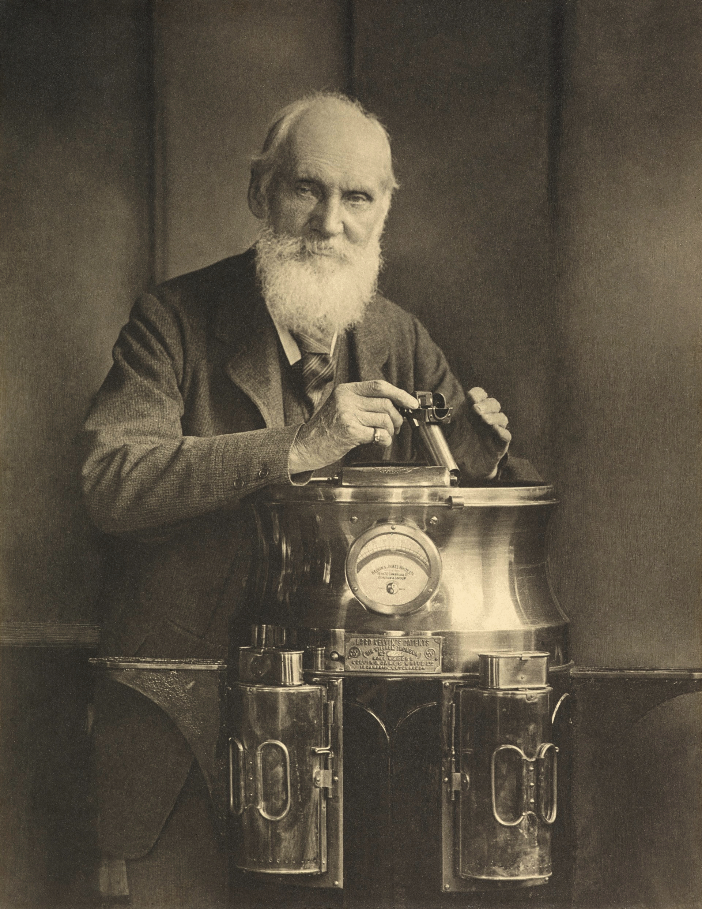

# Lord Kelvin — William Thomson (1824–1907)

  
  
<em>Lord Kelvin — William Thomson (1824–1907)</em>

## Overview

William Thomson, 1st Baron Kelvin, was a British physicist and engineer whose contributions spanned thermodynamics, electromagnetism, hydrodynamics, and geophysics. He is best known for establishing the absolute temperature scale that bears his name, for formulating the second law of thermodynamics alongside Clausius, and for his pivotal engineering role in laying the first transatlantic telegraph cable. One of the most honored scientists of the Victorian era, Kelvin was also notable for famous misjudgments — including wildly underestimating Earth's age and dismissing the emerging atomic theory and radioactivity — illustrating how brilliance can coexist with blind spots.

## Early Life and Education

Thomson was born on 26 June 1824 in Belfast, Ireland (now Northern Ireland). His father, James Thomson, was a professor of mathematics at the Royal Academical Institution in Belfast and later at Glasgow University, and provided his son with an exceptional early education. William enrolled at Glasgow University at age ten and transferred to Peterhouse, Cambridge, where he graduated as Second Wrangler in 1845, narrowly missing top honors. He spent time in Paris working in Victor Regnault's laboratory, absorbing French mathematical physics — particularly the work of Fourier and Carnot — before returning to Glasgow, where he was appointed Professor of Natural Philosophy at age twenty-two, a position he held for fifty-three years.

## Thermodynamics

Thomson's most fundamental scientific contribution was helping to establish thermodynamics as a rigorous science. In 1848 he proposed an absolute temperature scale based on Carnot's work, independent of any material substance — what we now call the Kelvin scale, where zero (absolute zero, 0 K = −273.15 °C) represents the complete absence of thermal energy. This scale is universally used in science.

Working in parallel with Rudolf Clausius, Thomson formulated the second law of thermodynamics: heat cannot spontaneously flow from a colder body to a hotter one. He also articulated the concept of the dissipation of energy — that mechanical work degrades irreversibly into heat — which led him to prophesy the eventual "heat death of the universe," a state of maximum entropy in which no useful work can be extracted.

## Electromagnetism and the Atlantic Cable

Thomson made important mathematical contributions to the theory of electrostatics and was instrumental in providing a theoretical framework for Faraday's experimental findings. His 1853 analysis of the discharge of a Leyden jar predicted oscillatory behavior, anticipating the LC circuit.

His most celebrated engineering achievement was the transatlantic telegraph cable. When the first attempt failed in 1858, Thomson brought scientific rigor to a problem that had previously been approached by rule of thumb. He invented the mirror galvanometer — a sensitive device for detecting weak electrical signals — and the siphon recorder, and he personally sailed on the cable-laying ship *Great Eastern* in 1866 to supervise the successful deployment of the cable. This work made transatlantic communication possible and earned him a knighthood.

## Geophysics and the Age of the Earth

Thomson applied thermodynamic reasoning to the cooling of Earth and the Sun, arriving at estimates of their ages. He calculated that Earth could not be more than 100 million years old if it had been cooling from a molten state — a figure directly at odds with the hundreds of millions of years that geologists and Darwin's theory of evolution required. The controversy between Thomson and the geologists was fierce and prolonged. Thomson was wrong: he did not know about radioactive heating in Earth's interior, discovered only after his death, which extends Earth's age to 4.5 billion years. This remains the most famous scientific misjudgment of a great physicist.

## Other Contributions

Thomson's output was immense: he published over 600 scientific papers and held 70 patents. His contributions included:
- The **Joule-Thomson effect** (with James Prescott Joule): gases cool when they expand through a valve against a pressure drop, the basis of refrigeration and liquefaction of gases.
- **Hydrodynamics**: major work on wave motion and the shape of ships.
- **Vortex atom theory**: an unsuccessful but influential attempt to explain atomic structure in terms of knotted vortices in the aether, which unexpectedly stimulated the mathematics of knot theory.

## Later Life and Character

Thomson was elevated to the peerage in 1892, taking the title Baron Kelvin of Largs. He was the first British scientist to sit in the House of Lords. He became President of the Royal Society (1890–1895) and received the Order of Merit. Famous for his energy and sociability, he was also known in later life for public dismissals of X-rays as a hoax and of flight as impossible. He died on 17 December 1907 at his home, Netherhall, near Largs, Scotland, and was buried in Westminster Abbey near Newton.

## Legacy

The kelvin (K) is the SI base unit of thermodynamic temperature. His establishment of the absolute scale, his formulation of the second law of thermodynamics, and his engineering of the transatlantic cable are enduring contributions. His career also serves as a case study in how even great minds can resist transformative discoveries — a lesson important for the sociology of science.

## Key Works

- "On an Absolute Thermometric Scale" (1848)
- "On the Theory of the Electric Telegraph" (1855)
- *Treatise on Natural Philosophy* (with P.G. Tait, 1867)
- *Popular Lectures and Addresses* (3 vols., 1889–1894)
