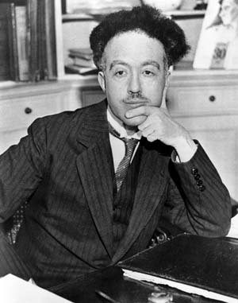

# Louis de Broglie (1892–1987)

  
  
<em>Louis de Broglie (1892–1987)</em>

## Overview

Louis-Victor-Pierre-Raymond, 7th duc de Broglie, was a French physicist who proposed one of the most radical and fruitful ideas in the history of quantum mechanics: that matter, like light, has a wave nature. His 1924 doctoral thesis proposed that all particles have an associated wavelength inversely proportional to their momentum — the de Broglie hypothesis — and introduced the concept of matter waves. This idea was the direct inspiration for Schrödinger's wave equation and was confirmed experimentally by electron diffraction within three years of its publication. De Broglie received the Nobel Prize in Physics in 1929, making him the first person ever awarded the prize on the basis of a doctoral thesis.

## Early Life and Education

Louis de Broglie was born on 15 August 1892 in Dieppe, Normandy, into one of France's most distinguished aristocratic families. His eldest brother Maurice de Broglie was an experimental physicist who worked on X-rays and had a private laboratory in Paris where Louis spent many hours. Initially Louis studied history and planned a career in the diplomatic service; he obtained a degree in history in 1910. But the intellectual atmosphere of his brother's laboratory and exposure to Poincaré's theoretical work drew him to physics.

He studied theoretical physics at the Sorbonne and, after his military service (spent as a radio operator attached to the Eiffel Tower wireless station, where he worked on communications during World War I), resumed his physics studies. He pursued his doctorate under Paul Langevin at the Sorbonne.

## The De Broglie Hypothesis

By 1923 de Broglie was thinking deeply about the wave-particle duality of light. Einstein had shown in 1905 that light — long understood as a wave — also behaves as a particle (the photon). De Broglie asked a bold converse question: if waves can behave as particles, can particles behave as waves?

For a photon, the momentum is p = E/c = hν/c = h/λ, giving λ = h/p. De Broglie proposed that this relation is universal: for **any** particle with momentum p, there is an associated wavelength:

**λ = h/p**

where h is Planck's constant. For an electron with kinetic energy corresponding to a few electron-volts, this gives a wavelength of about an ångström — comparable to atomic spacings and to the wavelength of X-rays. This immediately suggested that electrons should diffract from crystal lattices just as X-rays do.

De Broglie also proposed a mechanism: the electron in a Bohr orbit is stable because its de Broglie wave fits as a standing wave around the orbit (an integer number of wavelengths). This gave an elegant derivation of Bohr's quantization condition from wave principles.

Langevin found the thesis so unusual that he sent a copy to Einstein, who responded enthusiastically: "He has lifted a corner of the great veil." The thesis was accepted in November 1924.

## Experimental Confirmation

Confirmation came rapidly and from two directions. In 1927 Clinton Davisson and Lester Germer at Bell Labs accidentally discovered electron diffraction when a nickel crystal they were studying developed a large, regular crystalline structure after an annealing accident. Their diffraction patterns matched de Broglie's predictions precisely. At the same time, George Paget Thomson (J.J. Thomson's son) demonstrated electron diffraction by passing electrons through thin metal films. Davisson and Thomson shared the Nobel Prize in Physics in 1937 for this experimental confirmation of de Broglie's hypothesis.

The Nobel Committee awarded de Broglie the 1929 Nobel Prize in Physics — the only Nobel ever awarded based primarily on a doctoral dissertation.

## Influence on Wave Mechanics

De Broglie's matter waves were the direct inspiration for Erwin Schrödinger's 1926 wave equation. Schrödinger, reading de Broglie's thesis and Einstein's enthusiastic comments, set out to write a proper wave equation for de Broglie's matter waves. The result was the Schrödinger equation, the central equation of non-relativistic quantum mechanics.

## Later Career and the Pilot Wave Theory

After his Nobel Prize, de Broglie held the chair of theoretical physics at the Sorbonne and later at the Henri Poincaré Institute. He was a member and later permanent secretary of the French Academy of Sciences.

In the 1920s de Broglie himself had proposed a "pilot wave" interpretation of quantum mechanics — the idea that real particles are guided by real waves, rather than the probabilistic Copenhagen interpretation. He abandoned this view under pressure from Bohr and Pauli at the 1927 Solvay Conference. In the 1950s, when David Bohm independently rediscovered and developed the pilot wave theory, de Broglie revived his interest in it, spending much of his later career developing what he called the "theory of the double solution." This deterministic, hidden-variable approach to quantum mechanics remains a minority position but an important one philosophically.

De Broglie lived to ninety-four, dying on 19 March 1987 — the last surviving figure from the great generation that created quantum mechanics.

## Legacy

The de Broglie wavelength is a fundamental concept in quantum mechanics, quantum chemistry, and materials science. Electron diffraction is the basis of electron microscopy. Neutron diffraction is used to determine protein structures. The wave nature of matter is essential to understanding atomic bonding, superconductivity, and the behavior of quantum gases (Bose-Einstein condensation). De Broglie's audacious hypothesis transformed our understanding of the nature of matter.

## Key Works

- "Recherches sur la théorie des quanta" (doctoral thesis, 1924)
- "Ondes et Mouvements" (Waves and Motions, 1926)
- "La mécanique ondulatoire" (Wave Mechanics, 1928)
- "Non-Linear Wave Mechanics: A Causal Interpretation" (1960)
