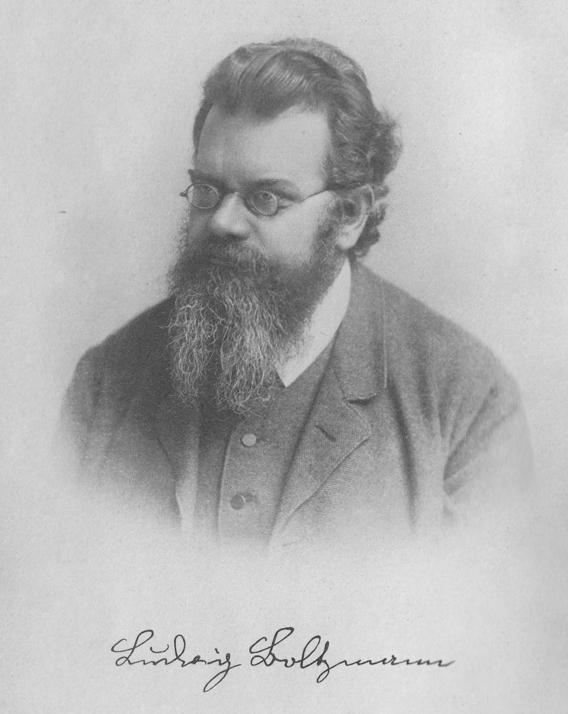

# Ludwig Boltzmann (1844–1906)

  
  
<em>Ludwig Boltzmann (1844–1906)</em>

## Overview

Ludwig Boltzmann was an Austrian physicist and philosopher whose life's work established the statistical and atomistic foundations of thermodynamics. By deriving the laws of heat and entropy from the mechanical behavior of atoms, he bridged the macroscopic world of classical thermodynamics and the microscopic world of atomic theory — a synthesis that was controversial in his own time but is now universally accepted. His famous equation S = k log W, engraved on his tombstone in Vienna, remains one of the most profound statements in all of physics.

## Early Life and Education

Boltzmann was born on 20 February 1844 in Vienna, Austria. His father, Ludwig Georg Boltzmann, was a revenue official; his mother, Katharina Pauernfeind, came from a prosperous Salzburg family. He showed early talent in music (he studied piano with Anton Bruckner) as well as mathematics. He enrolled at the University of Vienna, where he studied under Josef Stefan, the physicist who discovered the Stefan-Boltzmann radiation law (to which Boltzmann later contributed the theoretical derivation). Boltzmann received his doctorate in 1866 at twenty-two, with a dissertation on the kinetic theory of gases.

## Statistical Mechanics and the Boltzmann Equation

In the 1860s and 1870s, the kinetic theory of gases — that heat is the random motion of atoms — was still contested. Boltzmann's first great work was the Boltzmann transport equation (1872), which describes the statistical evolution of a gas in terms of the probability distribution of molecular velocities. From it he derived the famous H-theorem, which showed that entropy (defined as the negative of his H function) cannot decrease in an isolated system — providing a microscopic derivation of the second law of thermodynamics.

The H-theorem provoked immediate controversy. Critics raised the "reversibility objection" (Loschmidt's paradox): since Newton's laws are time-reversible, how can an irreversible increase in entropy arise from reversible molecular collisions? And the "recurrence objection" (Zermelo's paradox): Poincaré's recurrence theorem implies that any mechanical system will eventually return to its initial state. Boltzmann's response was profound: the second law is not absolute but statistical. Entropy increases not because it must, but because the overwhelming majority of possible molecular configurations correspond to higher-entropy states. A spontaneous decrease in entropy is possible but astronomically improbable.

## Statistical Entropy and S = k log W

Boltzmann's deepest insight was his 1877 identification of entropy with the number of microscopic states W (Wahrscheinlichkeit, probability) corresponding to a given macroscopic state:

**S = k log W**

where k is Boltzmann's constant (named by Planck in Boltzmann's honor). This equation connects thermodynamics with combinatorics: entropy is a measure of disorder or the number of ways a system can be arranged at the microscopic level while appearing the same at the macroscopic level. It is the foundation of statistical mechanics and remains one of the deepest equations in physics.

## The Maxwell-Boltzmann Distribution

Building on Maxwell's earlier work, Boltzmann derived the Maxwell-Boltzmann distribution — the probability distribution of molecular speeds and energies in a gas at thermal equilibrium. He generalized this to the Boltzmann distribution: the probability that a system is in a state with energy E is proportional to e^(−E/kT), where T is temperature. This exponential factor appears throughout modern physics, chemistry, and engineering.

## Atomism and Its Critics

Throughout his career Boltzmann was a passionate defender of atomic theory at a time when many leading physicists and chemists — including Wilhelm Ostwald and Ernst Mach — rejected atoms as metaphysical constructs. For Mach, only observable quantities could have scientific meaning; atoms were unobservable and therefore meaningless. The "energeticists" sought to base all of physics on energy rather than atoms.

Boltzmann argued strenuously and often brilliantly for atomism, but the debates exhausted and demoralized him. He suffered from severe manic-depressive illness and his mental health deteriorated significantly in the years of controversy. He held professorships at Graz, Munich, Vienna, and Leipzig, moving repeatedly partly in search of more sympathetic intellectual environments.

## Death and Vindication

In 1906, while vacationing at Duino near Trieste, Boltzmann hanged himself on 5 September, apparently during a bout of depression. He was sixty-two. The exact reasons remain unclear, but the unrelenting attacks on his atomic theory, combined with his illness, were certainly contributing factors.

The tragedy was compounded by timing: within months of his death, Einstein published his 1905 paper on Brownian motion, which provided the first direct, quantitative evidence for the reality of atoms. Perrin's subsequent experiments confirmed Einstein's predictions, definitively vindicating Boltzmann's atomism. Mach and the energeticists were wrong.

## Legacy

Boltzmann's constant k = 1.380649 × 10⁻²³ J/K is a fundamental constant of nature, now used to define the kelvin itself in the SI system. Statistical mechanics, which he essentially founded, underpins chemistry, solid-state physics, astrophysics, information theory, and modern thermodynamics. His philosophical writings on the epistemology of science anticipate many themes in twentieth-century philosophy of science. The equation S = k log W, which he never wrote in exactly that form during his lifetime, is engraved on his grave marker in Vienna's Zentralfriedhof.

## Key Works

- "Studien über das Gleichgewicht der lebendigen Kraft zwischen bewegten materiellen Punkten" (1868)
- "Weitere Studien über das Wärmegleichgewicht unter Gasmolekülen" (1872) — containing the H-theorem
- "Über die Beziehung zwischen dem zweiten Hauptsatze der mechanischen Wärmetheorie und der Wahrscheinlichkeitsrechnung" (1877) — containing S = k log W
- *Vorlesungen über Gastheorie* (Lectures on Gas Theory, 2 vols., 1896–1898)
