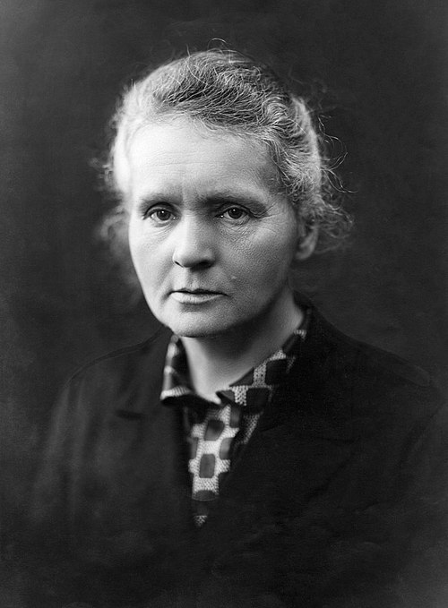

# Marie Curie (1867–1934)

  
  
<em>Marie Curie (1867–1934)</em>

## Overview

Marie Skłodowska Curie was a Polish-French physicist and chemist who pioneered the study of radioactivity — a term she coined — and became the first person to win Nobel Prizes in two different sciences. She discovered two new elements, polonium and radium, and her work opened the door to nuclear physics and medicine. A towering scientific figure in an era deeply hostile to women in science, she endured decades of discrimination while producing work that transformed our understanding of matter and energy.

## Early Life and Education

Maria Skłodowska was born on 7 November 1867 in Warsaw, then part of the Russian-controlled Congress Poland. Her father, Władysław Skłodowski, was a physics and mathematics teacher; her mother Bronisława was a school headmistress who died of tuberculosis when Maria was ten. Under Russian rule, women were barred from Polish universities. Maria and her sister Bronisława made a pact: Maria would work to support Bronisława's medical studies in Paris, and Bronisława would then support Maria's.

Maria worked as a governess for six years, secretly attending the "Flying University" — clandestine classes taught in private homes. In 1891 she finally arrived in Paris and enrolled at the Sorbonne, changing her name to Marie. She earned a degree in physics (ranked first) in 1893 and a degree in mathematics (ranked second) in 1894, extraordinary achievements for a foreign woman at the time.

## Meeting Pierre Curie and Early Research

In 1894 Marie met Pierre Curie, a physicist with a distinguished reputation for work on crystalline symmetry and piezoelectricity. They married in 1895. Their scientific partnership was one of the most productive in history. Marie chose radioactivity — the puzzling phenomenon discovered by Becquerel in 1896, in which uranium spontaneously emits radiation — as the subject of her doctoral research.

Using a sensitive electrometer devised by Pierre and his brother Jacques, Marie showed that the ionizing radiation from uranium was proportional to the amount of uranium present and independent of its chemical state — proving it was an atomic property. This was a crucial insight: radioactivity is a property of the atomic nucleus itself, not a chemical phenomenon.

## Discovery of Polonium and Radium

Testing other materials, Marie found that thorium was also radioactive. She then examined pitchblende (uranium ore) and found it far more radioactive than its uranium content alone could explain. She concluded that it must contain one or more unknown, intensely radioactive elements.

Working in a leaking shed with minimal equipment, the Curies undertook an extraordinary chemical labor: processing tons of pitchblende to isolate the new elements. In 1898 they announced the discovery of **polonium** (named for Marie's homeland) and **radium** — the latter so radioactive that a gram of radium produces about 0.1 watts of heat continuously without any external energy source.

In 1903 Marie Curie became the first woman in France to earn a doctorate in physics. That same year she and Pierre shared the Nobel Prize in Physics with Becquerel for the discovery of radioactivity.

## Tragedy and Second Nobel Prize

In April 1906 Pierre was struck and killed by a horse-drawn wagon in Paris. Marie was shattered but determined to continue. She was appointed to his professorship at the Sorbonne — the first woman to hold such a position at that institution. In 1911 she was awarded the Nobel Prize in Chemistry for the discovery of polonium and radium and for her isolation of radium and study of its properties — making her the first and, for nearly a century, only person to win Nobel Prizes in two different sciences.

That same year she became embroiled in a scandal: French newspapers published letters suggesting an affair with the physicist Paul Langevin, who was estranged from his wife. The press attacked her viciously, combining xenophobia, sexism, and antisemitism (she was neither Jewish nor an immigrant, but was falsely accused of both). She was nearly denied permission to collect her Nobel Prize.

## The Radium Institute and World War I

In 1914 Marie founded the Radium Institute (now the Institut Curie) in Paris. During World War I she organized a fleet of mobile X-ray units — nicknamed "petites Curies" — that brought radiographic diagnosis to wounded soldiers near the front. It is estimated these units conducted over a million X-ray examinations during the war. Her daughter Irène assisted her.

## Death and Legacy

Curie's lifelong exposure to radioactivity without protection took its toll. She developed aplastic anemia — damage to the bone marrow from radiation — and died on 4 July 1934 at a sanatorium in Passy, France. Her notebooks remain so radioactive today that they are kept in lead-lined boxes at the Bibliothèque nationale de France; researchers wishing to examine them must sign a liability waiver.

In 1995 her remains were transferred to the Panthéon in Paris — the first woman to be interred there on her own merits. Her daughter Irène Joliot-Curie won the Nobel Prize in Chemistry in 1935 for the discovery of artificial radioactivity. The element curium (Cm, atomic number 96) is named in honor of both Pierre and Marie Curie.

## Key Works

- Doctoral thesis: "Recherches sur les substances radioactives" (1903)
- *Traité de radioactivité* (Treatise on Radioactivity, 2 vols., 1910)
- Numerous papers in *Comptes Rendus de l'Académie des Sciences*
