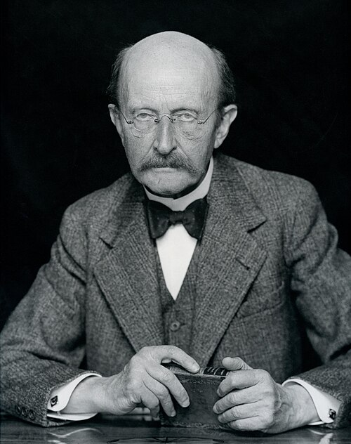

# Max Planck (1858–1947)

  
  
<em>Max Planck (1858–1947)</em>

## Overview

Max Karl Ernst Ludwig Planck was a German theoretical physicist who originated quantum theory — one of the two foundational revolutions of twentieth-century physics. In 1900, while trying to explain the spectrum of radiation emitted by a hot body, Planck proposed that energy is not continuous but comes in discrete packets he called *quanta*. This idea, which he himself initially viewed as a mathematical trick, launched quantum mechanics and permanently altered humanity's understanding of nature at the atomic scale.

## Early Life and Education

Planck was born on 23 April 1858 in Kiel, in the Duchy of Holstein, into a family with a tradition of scholarship and public service — his grandfather and great-grandfather had been theology professors, and his father was a professor of civil law. The family moved to Munich when Planck was nine. He excelled at secondary school and showed early aptitude for music as well as science. His music teacher told him he might have had a career as a professional pianist, but physics won.

He studied physics at the University of Munich and then Berlin, where he attended lectures by Helmholtz and Kirchhoff. When he asked the Munich physics professor Philipp von Jolly whether there was still anything worth studying in physics, von Jolly replied — famously — that nothing remained to be discovered. Planck pursued physics anyway. He received his doctorate from Munich in 1879 with a dissertation on the second law of thermodynamics, a topic he returned to repeatedly.

## The Blackbody Problem and the Quantum

The central problem Planck attacked in the 1890s was blackbody radiation: what is the spectrum of electromagnetic radiation emitted by a perfectly absorbing and emitting body in thermal equilibrium? The experimental data were precise, but existing theories failed: the Rayleigh-Jeans law was accurate at low frequencies but predicted infinite total energy at high frequencies (the "ultraviolet catastrophe"), while Wien's law worked at high frequencies but failed at low.

On 14 December 1900 — a date sometimes called the birthday of quantum mechanics — Planck presented to the German Physical Society a formula that perfectly matched the experimental data across all frequencies. To derive it mathematically, he had to assume that the electromagnetic oscillators in the blackbody walls could only emit and absorb energy in discrete amounts:

**E = hν**

where ν is the frequency of radiation and h is a new fundamental constant — now called Planck's constant (h ≈ 6.626 × 10⁻³⁴ J·s). Energy was quantized.

Planck was uncomfortable with this step. He had introduced quantization as a calculational device and hoped it would eventually be explained away by classical physics. It never was. Einstein's 1905 paper on the photoelectric effect showed that light itself consists of quanta (photons), going further than Planck intended. Planck eventually accepted quantization as fundamental, but remained skeptical of some aspects of quantum mechanics throughout his life.

## Planck's Constant and Fundamental Units

Planck recognized that his new constant h, combined with the speed of light c and the gravitational constant G, yielded natural units of length, time, and mass — now called Planck units — that are independent of any human artifact. The Planck length (~1.6 × 10⁻³⁵ m) and Planck time (~5.4 × 10⁻⁴⁴ s) are now understood as scales at which quantum gravitational effects become significant.

## Later Career and Personal Tragedies

Planck succeeded Kirchhoff as professor of theoretical physics at the University of Berlin in 1889 and was elected to the Prussian Academy of Sciences in 1894. He served as President of the Kaiser Wilhelm Society (now the Max Planck Society) from 1930 to 1937. He received the Nobel Prize in Physics in 1918 "in recognition of the services he rendered to the advancement of Physics by his discovery of energy quanta."

Planck's personal life was marked by profound grief. His first wife, Marie Merck, died in 1909. His eldest son, Karl, was killed in World War I. His twin daughters, Grete and Emma, both died in childbirth in 1917 and 1919, respectively. His second son, Erwin, was executed by the Nazis in 1944 for alleged involvement in the July 20 plot to assassinate Hitler — a tragedy that devastated Planck in his last years.

## Relationship with the Nazi Regime

Planck remained in Germany during the Nazi period, continuing to lead German scientific institutions in the hope of preserving them. He had a single, deeply uncomfortable meeting with Hitler in 1933, trying unsuccessfully to defend Jewish colleagues. He condemned the persecution of Jewish scientists privately but felt unable to make a public stand. Historians debate whether this was moral cowardice, pragmatic survival, or genuine loyalty to German science as an institution separate from the regime.

Planck's home in Berlin was destroyed by Allied bombing. He fled with his second wife and spent the final years of the war hiding from bombers. He died on 4 October 1947 in Göttingen at eighty-nine.

## Legacy

Planck's constant is now a cornerstone of modern physics, appearing in Heisenberg's uncertainty principle, Schrödinger's equation, Dirac's formulation of quantum mechanics, and quantum field theory. Since 2019 the SI unit of mass, the kilogram, is defined by fixing the numerical value of h. The Max Planck Society, with over 80 research institutes, is named in his honor and remains one of the world's premier scientific organizations.

## Key Works

- "Zur Theorie des Gesetzes der Energieverteilung im Normalspektrum" (1900) — the quantum paper
- *Vorlesungen über die Theorie der Wärmestrahlung* (Lectures on the Theory of Heat Radiation, 1906)
- *Einführung in die theoretische Physik* (Introduction to Theoretical Physics, 5 vols., 1916–1930)
