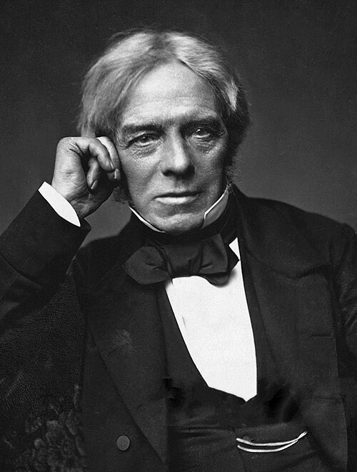

# Michael Faraday (1791–1867)

  
  
<em>Michael Faraday (1791–1867)</em>

## Overview

Michael Faraday was a British experimental physicist and chemist whose discoveries in electromagnetism and electrochemistry transformed natural philosophy into modern physics and laid the groundwork for electrical technology. Born into poverty and entirely self-educated in science, he rose to become one of the most celebrated scientists of the nineteenth century. His experimental genius — combined with an extraordinary ability to visualize invisible forces through the concept of field lines — gave James Clerk Maxwell the physical intuitions needed to write down the equations of electromagnetism.

## Early Life and Self-Education

Faraday was born on 22 September 1791 in Newington Butts, Surrey (now part of London), the third of four children of a blacksmith. The family was poor and deeply religious — members of a small Protestant sect called the Sandemanians, a faith that shaped Faraday's humility and honesty throughout his life. He received only basic schooling and at thirteen was apprenticed to a bookbinder. The bookshop proved transformative: Faraday read voraciously, particularly the article on "Electricity" in the *Encyclopædia Britannica* and Jane Marcet's *Conversations on Chemistry*.

In 1812 a client gave him tickets to four lectures by the chemist Humphry Davy at the Royal Institution. Faraday attended, took meticulous notes, and sent Davy a beautifully bound copy. When Davy temporarily lost his sight in a laboratory accident, he hired the young bookbinder as a secretary. In 1813 Faraday was appointed Chemical Assistant at the Royal Institution — the institution he would never leave, and eventually lead.

## Electromagnetic Induction

Faraday's most consequential discovery came on 29 August 1831. He had long suspected that if electricity could produce magnetism (as Ørsted had shown in 1820), then magnetism ought to produce electricity. After years of failed attempts he found the key: a *changing* magnetic field induces an electric current. Wrapping two coils of wire around an iron ring, he discovered that switching the current in one coil produced a brief surge in the other — electromagnetic induction by mutual inductance. Within weeks he had demonstrated induction by moving a magnet in and out of a coil of wire and by rotating a copper disc between the poles of a magnet — the world's first electric generator.

Faraday's law of induction — that the induced electromotive force equals the rate of change of magnetic flux — became one of Maxwell's four equations. Every electric motor, generator, and transformer in the world operates on Faraday's discovery.

## Field Theory

Faraday's greatest conceptual contribution was arguably the concept of the electromagnetic *field*. At a time when action at a distance dominated thinking, Faraday proposed that magnets and charges fill the space around them with "lines of force" — real physical entities that mediate interactions. He demonstrated these lines by sprinkling iron filings near magnets. This seemingly qualitative idea was, in Maxwell's hands, made quantitative and became the field concept central to all of modern physics, from electrodynamics to quantum field theory and general relativity.

## Electrochemistry

Faraday's work in chemistry was equally groundbreaking. He established the two laws of electrolysis (1833–1834): the mass of a substance deposited at an electrode is proportional to the charge passed, and for a given charge, the masses of different substances deposited are proportional to their equivalent weights. This work gave science precise, quantitative access to atomic-scale chemistry. Faraday also coined many of the terms still used today — *electrode*, *anode*, *cathode*, *ion*, *electrolyte*, *electrolysis* — in consultation with the classicist William Whewell.

## Other Discoveries

Faraday's experimental output was prodigious. He discovered benzene (1825), liquefied several gases previously thought permanent, demonstrated the diamagnetic repulsion of matter by magnetic fields, and discovered the Faraday effect (1845) — the rotation of the plane of polarized light by a magnetic field — directly connecting light and magnetism and providing Maxwell with a crucial clue.

## Character and Recognition

Faraday declined a knighthood and the presidency of the Royal Society, preferring to remain simply "Mr. Faraday." He was deeply modest, attributing his success to his faith and his notebooks. His *Experimental Researches in Electricity* (three volumes, 1839–1855) are a model of careful observation and lucid prose. His Christmas lectures for children at the Royal Institution, particularly *The Chemical History of a Candle* (1861), remain classics of scientific communication.

He suffered a mental breakdown in 1839 and experienced significant memory problems from the 1840s onward, possibly from mercury poisoning sustained during his chemical work. He died on 25 August 1867 at Hampton Court, where the government had given him a grace-and-favour house. Albert Einstein kept a photograph of Faraday on his study wall alongside Newton and Maxwell.

## Legacy

The unit of electrical capacitance, the farad, is named in his honor. Maxwell transformed Faraday's physical intuitions into the mathematical theory of electromagnetism, writing that Faraday's lines of force were "not less real" than mathematical results. Without Faraday's experimental discoveries, the electrical age — power generation, electric motors, radio, telecommunications — is unimaginable.

## Key Works

- *Experimental Researches in Electricity* (3 vols., 1839–1855)
- *Experimental Researches in Chemistry and Physics* (1859)
- *The Chemical History of a Candle* (1861)
