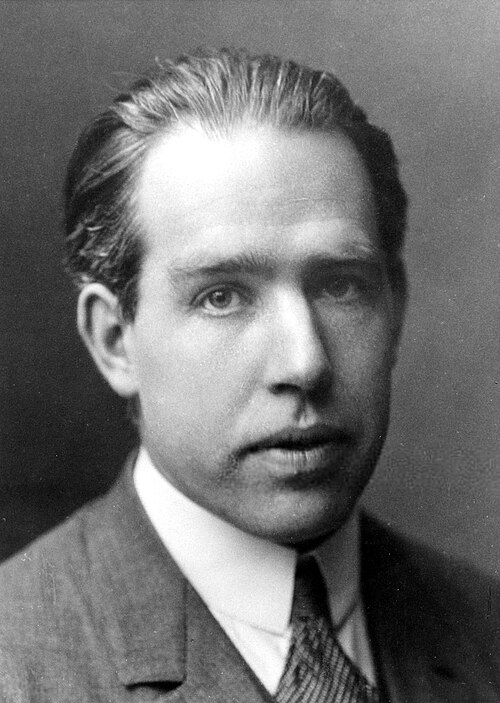

# Niels Bohr (1885–1962)

  
  
<em>Niels Bohr (1885–1962)</em>

## Overview

Niels Henrik David Bohr was a Danish physicist who fundamentally transformed our understanding of atomic structure and quantum mechanics. His 1913 model of the hydrogen atom — introducing quantized electron orbits — was the first successful quantum model of atomic structure and remains a cornerstone of introductory physics education. As the intellectual leader of the Copenhagen school, Bohr developed the philosophical interpretation of quantum mechanics (the Copenhagen interpretation) that most physicists still implicitly accept. He mentored virtually every major figure in quantum physics and, through the Institute for Theoretical Physics he founded, made Copenhagen a world center of physics for decades.

## Early Life and Education

Bohr was born on 7 October 1885 in Copenhagen, Denmark. His father, Christian Bohr, was a distinguished physiologist; his mother, Ellen Adler, came from a prominent Jewish banking family. The household was intellectually stimulating and Bohr grew up alongside his brother Harald, who became a famous mathematician. The brothers were also devoted football players — Harald represented Denmark in the 1908 Olympic Games.

Bohr studied physics at the University of Copenhagen, completing his master's degree in 1909 and his doctorate in 1911 with a dissertation on the electron theory of metals. Crucially, his dissertation showed that classical electromagnetism could not explain the properties of metals — atoms and electrons must behave differently from classical mechanics. He then traveled to England to work with Thomson at Cambridge and Rutherford at Manchester, where he encountered the nuclear atom and began thinking about electron structure.

## The Bohr Model of the Atom

Rutherford's 1911 nuclear atom had a serious problem: classical electrodynamics predicts that an electron orbiting a nucleus should radiate energy continuously and spiral into the nucleus within a fraction of a second. All atoms should be unstable. Yet they are not.

In 1913 Bohr proposed a radical solution, combining Rutherford's nuclear atom with Planck's quantum of action:

1. Electrons orbit the nucleus only in certain allowed orbits corresponding to discrete values of angular momentum (multiples of h/2π).
2. In these orbits, electrons do not radiate (abandoning classical electrodynamics).
3. Radiation is emitted or absorbed when an electron jumps between orbits, with the photon energy equal to the difference in orbital energies: E = hν.

Applied to hydrogen, this model gave the Rydberg formula — the empirical pattern of hydrogen's spectral lines — from first principles. The agreement with experiment was stunning and established quantization as a physical reality, not just a mathematical device.

The model was provisional — Bohr himself knew it violated classical physics in an ad hoc way — but it guided the development of quantum mechanics throughout the 1910s and early 1920s.

## The Copenhagen Interpretation

In the mid-1920s, Heisenberg, Schrödinger, Pauli, and Dirac built the full mathematical framework of quantum mechanics. Bohr's crucial contribution in this period was philosophical and interpretive: what does quantum mechanics mean?

The Copenhagen interpretation, developed primarily by Bohr in dialogue with Heisenberg, holds that:
- Quantum systems do not have definite properties (position, momentum) prior to measurement.
- The wave function represents our knowledge (or probability amplitudes), not a physical wave in real space.
- Quantum mechanics is complete — no hidden variables need to be added.
- Classical concepts are necessary to describe the measurement context, but quantum and classical descriptions are "complementary," not contradictory.

Bohr's concept of **complementarity** — that quantum objects exhibit wave-like or particle-like behavior depending on how they are observed, and that both pictures are needed for a complete description — became central to his interpretation. His debates with Einstein at the Solvay Conferences (1927, 1930) are among the most celebrated in scientific history. Einstein repeatedly devised thought experiments to challenge quantum mechanics; Bohr consistently found subtle rebuttals. Most physicists judge Bohr the winner of these debates.

## Institute for Theoretical Physics

In 1920 Bohr founded the Institute for Theoretical Physics in Copenhagen (now the Niels Bohr Institute), which he directed until his death. The institute became a mecca for young physicists: Heisenberg, Pauli, Dirac, Kramers, Klein, Gamow, Landau, and countless others worked or visited there. Bohr's style of conducting physics — through long, meandering conversations, patient dialogue, and conceptual wrestling — created a distinctive intellectual culture. His English was notoriously difficult to follow (he tended to speak while erasing the blackboard) but his insights were profound.

## Nuclear Fission and World War II

When Hahn, Strassmann, and Meitner discovered nuclear fission in December 1938, Bohr was one of the first to comprehend its implications. He and John Wheeler developed the liquid drop model of nuclear fission (1939), which explained the mechanism and correctly predicted that uranium-235 (not the more abundant uranium-238) was the isotope responsible for slow-neutron fission.

Bohr escaped from occupied Denmark in 1943 — his mother was Jewish and he faced arrest — flying to Sweden in a fishing boat and then being flown by the British in a modified bomber. He joined the Manhattan Project in Los Alamos under the pseudonym Nicholas Baker. He was deeply troubled by the bomb's implications and repeatedly sought meetings with Roosevelt and Churchill to urge international control of nuclear weapons — largely unsuccessfully.

He returned to Copenhagen after the war and became one of the leading advocates for peaceful uses of nuclear energy and international scientific cooperation. He died on 18 November 1962 following a stroke.

## Legacy

Bohr received the Nobel Prize in Physics in 1921 "for his services in the investigation of the structure of atoms and of the radiation emanating from them." The element bohrium (Bh, atomic number 107) is named in his honor. His institute and his philosophical framework for quantum mechanics shaped the entire subsequent development of physics.

## Key Works

- "On the Constitution of Atoms and Molecules" (1913, three-part paper)
- "The Quantum Postulate and the Recent Development of Atomic Theory" (1928) — the Como lecture on complementarity
- "Can Quantum-Mechanical Description of Physical Reality Be Considered Complete?" (with Rosenfeld, replying to EPR, 1935)
- "The Mechanism of Nuclear Fission" (with Wheeler, 1939)
