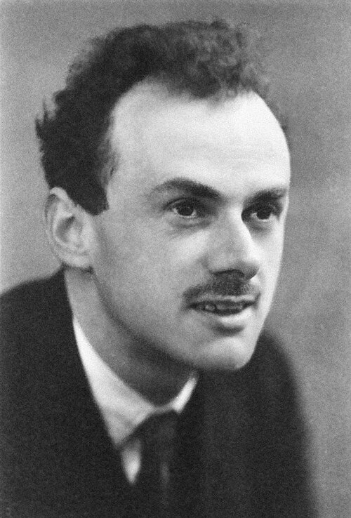

# Paul Dirac (1902–1984)

  
  
<em>Paul Dirac (1902–1984)</em>

## Overview

Paul Adrien Maurice Dirac was a British theoretical physicist who formulated the relativistic quantum mechanical wave equation that bears his name, predicted the existence of antimatter, and contributed foundational work to quantum field theory. He shared the Nobel Prize in Physics in 1933 with Schrödinger. Widely regarded as the greatest British theoretical physicist since Newton, Dirac was known for his extraordinary mathematical precision and laconic personality — he communicated almost exclusively through equations and was famously sparing with words. Heisenberg called him "the strangest man."

## Early Life and Education

Dirac was born on 8 August 1902 in Bristol, England. His father, Charles Adrien Ladislas Dirac, was a Swiss-French schoolteacher who insisted that at mealtimes, Paul and his siblings could only speak French with him. Charles was a domineering and emotionally withholding father, and Dirac's extreme introversion — later considered a possible characteristic of autism — may have been shaped by this upbringing. He later said of his childhood: "I never knew how to express myself."

Dirac was a brilliant student in mathematics and physics. He completed an undergraduate degree in electrical engineering at the University of Bristol in 1921, but could not find an engineering job during the postwar economic depression. He was offered a place to study mathematics at Cambridge but could not afford the fees; Bristol gave him free tuition for two years of mathematics, after which he went to Cambridge and completed a doctoral thesis under Ralph Fowler in 1926.

## The Dirac Equation

Quantum mechanics as developed by Heisenberg, Schrödinger, and Born was non-relativistic — it did not respect Einstein's special relativity. Schrödinger had himself tried and failed to write a relativistic wave equation. The Klein-Gordon equation worked for spinless particles but was unsatisfactory.

In 1928 Dirac set himself the problem of finding a relativistic wave equation for the electron. His key insight was that the equation should be first-order in both time and space derivatives — unlike the Klein-Gordon equation, which is second-order. The only way to achieve this while remaining consistent with relativity was to use matrices. The **Dirac equation** takes the form:

**(iγᵘ∂ᵤ − mc)ψ = 0**

where γᵘ are 4×4 matrices (now called Dirac matrices) and ψ is a four-component spinor.

The Dirac equation had immediate, stunning consequences:
1. It automatically incorporated electron spin — without any ad hoc assumption.
2. It predicted the correct magnetic moment of the electron.
3. It had negative-energy solutions — a mathematical problem that Dirac turned into a profound physical prediction.

## The Prediction of Antimatter

The negative-energy solutions were troubling: what prevents an electron from radiating energy and falling into negative-energy states? Dirac's 1930 proposal — the "Dirac sea" — was that all negative-energy states are already filled with electrons (consistent with the Pauli exclusion principle). A "hole" in this filled sea — a missing electron from a negative-energy state — would behave like a positively charged particle with the electron's mass: a positron.

In 1932 Carl Anderson discovered the positron experimentally in cosmic ray tracks — exactly as Dirac had predicted. This was the discovery of **antimatter** — the first demonstration that for every particle there exists a corresponding antiparticle. Antimatter is now produced in particle accelerators, used in medical PET scanning, and understood as a fundamental feature of quantum field theory.

## Quantum Field Theory and Other Contributions

Dirac made foundational contributions to quantum field theory — the quantum description of fields, particularly the electromagnetic field. His 1927 paper on the quantum theory of radiation quantized the electromagnetic field for the first time, treating photons as excitations of quantum fields, and computed the probabilities for emission and absorption of light by atoms. This paper essentially founded quantum electrodynamics.

He introduced **Dirac notation** (bras and kets: |ψ⟩, ⟨φ|) — the elegant and universal notation now used throughout quantum mechanics. He introduced the Dirac delta function as a generalized function for use in physics. He derived the quantization condition for magnetic monopoles — showing that if a single magnetic monopole exists anywhere in the universe, all electric charges must be quantized (a deep insight whose experimental implications remain unresolved). He formulated the path integral approach to quantum mechanics, which Feynman later developed into a complete calculational framework.

## Personality and Mathematical Aesthetics

Dirac was famously monolingual in mathematics. After a lecture, when an audience member said "I don't understand your derivation of this formula," Dirac — who interpreted statements literally — replied: "That is not a question." He reportedly went a year in Copenhagen communicating almost entirely through chess.

He had a deep conviction that fundamental physics must be described by beautiful mathematics. In his later years he grew increasingly troubled by the infinities of quantum electrodynamics, even after Feynman, Schwinger, and Tomonaga developed renormalization to handle them — he considered renormalization a mathematical trick rather than a genuine physical solution.

He held the Lucasian Chair of Mathematics at Cambridge (the chair Newton had held) from 1932 to 1969, then spent his last years at Florida State University in Tallahassee, where he died on 20 October 1984.

## Legacy

The Dirac equation is one of the fundamental equations of physics; it describes all spin-1/2 particles and is the starting point for quantum electrodynamics and the Standard Model. The prediction of antimatter is among the greatest theoretical predictions in the history of science. Dirac notation is universal in quantum mechanics and quantum information theory.

## Key Works

- "The Quantum Theory of the Electron" (1928) — the Dirac equation
- "A Theory of Electrons and Protons" (1930) — the Dirac sea and prediction of positron
- *The Principles of Quantum Mechanics* (1930) — the definitive textbook of quantum mechanics
- "Quantised Singularities in the Electromagnetic Field" (1931) — magnetic monopoles
