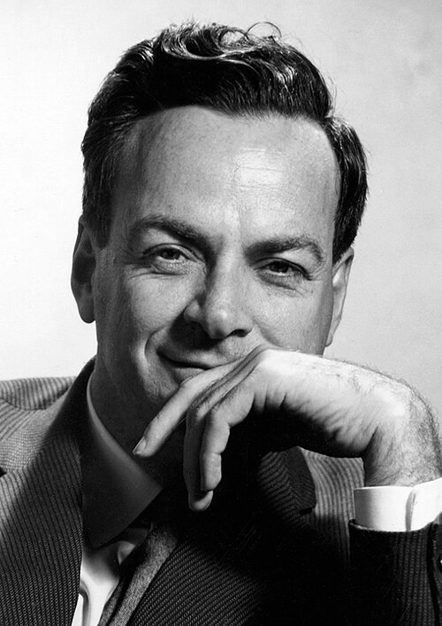

# Richard Feynman (1918–1988)

  
  
<em>Richard Feynman (1918–1988)</em>

## Overview

Richard Phillips Feynman was an American theoretical physicist who revolutionized the way physicists think about and calculate quantum processes, developed the path integral formulation of quantum mechanics, and co-developed quantum electrodynamics (QED) into its modern, calculationally powerful form. He received the Nobel Prize in Physics in 1965 (with Schwinger and Tomonaga). A gifted teacher, raconteur, and popularizer of science, Feynman was also a bongo drummer, safecracker, and artist — a polymath personality that made him the most publicly beloved physicist of the late twentieth century.

## Early Life and Education

Feynman was born on 11 May 1918 in Queens, New York City, to Melville Feynman, a salesman, and Lucille Phillips. His father cultivated in Richard a love of inquiry by showing him the wonders of everyday phenomena. By high school he was teaching himself trigonometry, advanced algebra, and calculus independently. He gained a perfect score on the mathematics component of the New York University mathematics championship at fifteen.

He enrolled at MIT as an undergraduate, initially in mathematics but switching to physics, and graduated in 1939. He applied to Princeton for graduate school and was admitted — though with some initial hesitation about his background (he was Jewish, at a time when Princeton had informal quotas). He worked under John Wheeler, completing a doctoral thesis on the least-action principle in quantum mechanics — the germ of his later path integral work.

## The Path Integral Formulation

Feynman's doctoral thesis and subsequent work in the early 1940s developed a new formulation of quantum mechanics based on the principle of least action. In classical mechanics, a particle takes the path that minimizes the action (the time integral of kinetic minus potential energy). Feynman proposed that in quantum mechanics, a particle simultaneously "takes all paths" from start to finish, each path contributing an amplitude proportional to e^(iS/ℏ) where S is the classical action along that path. The probability amplitude for any process is the sum (the integral) over all possible paths.

The **path integral** (or Feynman integral) formulation is mathematically equivalent to the Schrödinger and Heisenberg formulations but has enormous conceptual and computational advantages in quantum field theory. It is the natural framework for understanding instantons, vacuum transitions, quantum gravity, and the Standard Model of particle physics. Modern calculations in quantum field theory almost universally use path integrals.

## Quantum Electrodynamics and Feynman Diagrams

The central problem of quantum electrodynamics in the 1940s was that calculations produced infinities — the self-energy of the electron diverged. Renormalization procedures existed but were ad hoc and physically opaque. Feynman, Schwinger (working independently from first principles), and Tomonaga (in Japan) each developed complete, consistent formulations of renormalized QED.

Feynman's contribution included the invention of **Feynman diagrams** — pictorial representations of particle interactions where lines represent particle propagators and vertices represent interactions. Each diagram corresponds to a specific term in the perturbation expansion of the interaction, and their value can be computed using simple, explicit rules (Feynman rules). The diagrams are not just computational shorthand; they convey physical intuition about what is happening at the quantum level.

QED as formulated by Feynman, Schwinger, and Tomonaga is the most precisely tested theory in the history of science. The magnetic moment of the electron is predicted by QED to eleven decimal places and agrees with experiment to the same precision. Feynman characterized this as equivalent to predicting the distance from New York to Los Angeles to within the width of a human hair.

## The Manhattan Project

During World War II Feynman was recruited to Los Alamos to work on the Manhattan Project, arriving in 1943. He led a group of computing workers who performed numerical calculations for implosion bomb design. He was also notorious for picking the locks of filing cabinets containing classified documents — not from malice but from a compulsion to demonstrate security flaws. He was present at the Trinity test.

## Teaching, Communication, and Popularization

After the war Feynman taught at Cornell and then joined Caltech in 1951, where he spent the rest of his career. He was by all accounts one of the greatest teachers in the history of physics. His *Feynman Lectures on Physics* (three volumes, 1963–1965), transcribed from his undergraduate physics course at Caltech, have been read and used by more physicists worldwide than any other physics text. They remain in print and are available free online.

His autobiographical books — *Surely You're Joking, Mr. Feynman!* (1985) and *What Do You Care What Other People Think?* (1988) — became bestsellers and introduced his personality to millions. He was famous for colorful anecdotes, intellectual honesty, and an unwillingness to accept authority or mystification.

## The Challenger Investigation

After his cancer diagnosis in 1986, Feynman agreed to serve on the Rogers Commission investigating the Space Shuttle Challenger disaster. His contribution was characteristically direct: at a televised hearing he produced a rubber O-ring from a NASA joint, placed it in a glass of ice water, and demonstrated that it lost elasticity at low temperatures — the cause of the disaster. His personal appendix to the commission report, which NASA tried to suppress, concluded: "For a successful technology, reality must take precedence over public relations, for Nature cannot be fooled."

Feynman died on 15 February 1988 in Los Angeles from two rare forms of kidney cancer. His last words were reported to be: "I'd hate to die twice. It's so boring."

## Legacy

Feynman diagrams are used in every calculation in particle physics, quantum field theory, condensed matter physics, and quantum chemistry. His path integral formulation is the foundation of modern quantum field theory. His QED work set the standard for precision physics. His teaching materials have introduced generations to physics. Feynman's personality — curious, irreverent, anti-authoritarian, delighting in discovery for its own sake — remains the ideal many physicists aspire to.

## Key Works

- "Space-Time Approach to Non-Relativistic Quantum Mechanics" (1948) — path integrals
- "Space-Time Approach to Quantum Electrodynamics" (1949) — Feynman diagrams
- *The Feynman Lectures on Physics* (3 vols., 1963–1965)
- *QED: The Strange Theory of Light and Matter* (1985)
