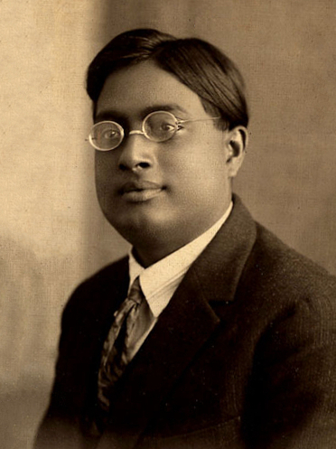

# Satyendra Nath Bose (1894–1974)

  
  
<em>Satyendra Nath Bose (1894–1974)</em>

## Overview

Satyendra Nath Bose was an Indian physicist whose 1924 derivation of Planck's blackbody radiation law — using a novel statistical method that treated photons as indistinguishable particles — founded a new branch of quantum statistics. Einstein recognized the significance immediately, extended Bose's method to material particles, and predicted a new state of matter — the Bose-Einstein condensate — that was not realized experimentally until 1995. The class of particles that obey this statistics — including photons, helium-4 atoms, and the Higgs boson — are universally called **bosons** in Bose's honor, one of the most recognizable terms in all of physics.

## Early Life and Education

Bose was born on 1 January 1894 in Calcutta (now Kolkata), British India, the eldest of seven children. His father, Surendranath Bose, was an accountant in the East Indian Railway. From an early age Bose showed exceptional ability in mathematics — in his entrance examination for Presidency College, Calcutta, he obtained the highest marks ever recorded. He studied at Presidency College alongside Meghnad Saha (with whom he would later collaborate on translation projects), graduated first in class with a BSc in mixed mathematics in 1913, and completed his MSc in applied mathematics in 1915, again placing first.

He and Saha together taught themselves the new quantum theory and the theory of relativity by reading German and French papers — an extraordinary feat given the limited resources of colonial Calcutta. They translated Einstein's papers on relativity into English from German, the first such translations to appear in India.

Bose became a lecturer at the University of Calcutta in 1916 and later joined the newly founded University of Dhaka (now Dhaka University in Bangladesh) in 1921 as a reader in physics.

## The Bose Derivation of Planck's Law

In 1924 Bose was lecturing on Planck's blackbody radiation formula to his students in Dhaka and found himself dissatisfied with the existing derivations, which used classical arguments in an inconsistent way. He worked out a new derivation that treated photons as indistinguishable, identical particles and counted the number of ways they could be distributed among available energy states — without the classical assumption that particles at different positions are distinguishable from each other.

The key conceptual step was **treating photons as identical in a fundamental sense**: two configurations that differ only in which photon is in which state should be counted as the same configuration, not as separate ones. This changed the counting combinatorics and naturally gave Planck's formula without any arbitrary assumptions.

Bose wrote up his derivation and submitted it to the Philosophical Magazine, which rejected it. He then wrote directly to Einstein, explaining the approach and asking Einstein to transmit it to a German journal if he thought it worthwhile. Einstein recognized immediately that this was a new and profound statistical method, translated the paper himself into German, added a note testifying to its importance, and published it in *Zeitschrift für Physik* in 1924.

## Bose-Einstein Statistics and Condensation

Einstein quickly saw that Bose's method could be applied not just to photons but to any quantum particles with integer spin. He published two papers (1924, 1925) extending the statistics to an ideal gas of material particles and discovered a remarkable prediction: at sufficiently low temperatures, a macroscopic fraction of the particles in such a gas condense into the lowest-energy quantum state — what Einstein called a "condensation without interaction forces."

This **Bose-Einstein condensate** (BEC) is a new state of matter in which a macroscopic number of particles occupy the same quantum state, forming a coherent quantum object that can display quantum mechanical effects on a macroscopic scale. It eluded experimental realization for seventy years because it requires temperatures in the billionths of a kelvin range. In 1995, Eric Cornell, Carl Wieman, and Wolfgang Ketterle achieved BEC in dilute atomic gases, winning the Nobel Prize in Physics in 2001.

Bose-Einstein statistics also underlies the behavior of lasers (photons are bosons), superfluidity in helium-4, superconductivity (through Cooper pairs of electrons behaving as composite bosons), and the Higgs boson — the "God particle" announced at CERN in 2012.

## Recognition and Later Career

In 1924, after Einstein's endorsement, Bose was able to secure leave to travel to Europe, where he worked in de Broglie's laboratory in Paris and in Berlin with Einstein himself. On his return he was appointed professor at Dhaka and later Calcutta universities.

Despite the enormous importance of his contributions, Bose was never awarded the Nobel Prize — a widely noted omission. He received India's second-highest civilian honor, the Padma Vibhushan, in 1954. He was elected a Fellow of the Royal Society in 1958. He served as National Professor of India from 1958 to 1974.

Bose worked in statistical mechanics, electromagnetic theory, and unified field theory in his later years, as well as in science policy and education in independent India. He died on 4 February 1974 in Calcutta.

## Legacy

The word "boson" — used trillions of times daily in physics — is the permanent memorial to Bose's contribution. The Bose-Einstein condensate is now a thriving field of physics research with applications in precision measurement, quantum computing, and the study of fundamental physics. Bose's story also illustrates how scientific communication worked in the early twentieth century: a relatively isolated physicist in colonial India could, through a single letter to Einstein, change the foundations of physics.

## Key Works

- "Plancks Gesetz und Lichtquantenhypothese" (Planck's Law and Light Quantum Hypothesis, 1924) — the foundational paper, transmitted by Einstein
- Various papers on unified field theories and statistical mechanics (1930s–1950s)
