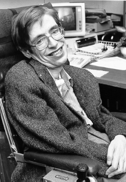

# Stephen Hawking (1942–2018)

  
  
<em>Stephen Hawking (1942–2018)</em>

## Overview

Stephen William Hawking was a British theoretical physicist and cosmologist whose contributions to the understanding of black holes, the Big Bang, and quantum gravity made him one of the most celebrated scientists of his era. His discovery that black holes emit thermal radiation (Hawking radiation) is widely regarded as one of the most important results in theoretical physics of the twentieth century, combining quantum mechanics with general relativity in a single profound calculation. He also became one of the most effective popular communicators of science in history, and his survival and productivity despite a progressive motor neuron disease for over fifty years was an extraordinary achievement of will and intellect.

## Early Life and Education

Hawking was born on 8 January 1942 in Oxford, England — exactly three hundred years after the death of Galileo. His father, Frank Hawking, was a research biologist specializing in tropical diseases; his mother, Isobel Walker, was an intellectual who had read politics, philosophy, and economics at Oxford. The family was unconventional and bookish — their car was too old and unreliable to bother locking.

Hawking was not a prodigious student in childhood but showed exceptional ability in mathematics. He studied physics at University College, Oxford (finding it insufficiently challenging), then enrolled in the mathematics department of the University of Cambridge in 1962 for his doctorate. He hoped to work under Fred Hoyle on cosmology; instead he was assigned to Dennis Sciama, who proved to be an inspired supervisor.

## Motor Neuron Disease

In his first year at Cambridge, Hawking began to notice symptoms: stumbling, slurring speech, dropping things. Shortly after his twenty-first birthday, in 1963, he was diagnosed with amyotrophic lateral sclerosis (ALS) — a progressive, degenerative disease of the motor neurons. Doctors gave him two years to live.

He did not die. The disease progressed slowly compared to most ALS cases. By the mid-1970s he was confined to a wheelchair; by 1985 he lost his voice following a tracheotomy (performed to save him from pneumonia). From then on he communicated through a speech synthesizer, eventually controlling it by twitching a cheek muscle. He continued to produce important research for decades, dictating papers letter by letter.

His survival, widely attributed partly to the exceptional care of those around him (including two nurses who worked with him continuously), became a symbol of human determination over physical limitation.

## Singularity Theorems and the Big Bang

Working with Roger Penrose in the mid-1960s, Hawking proved the **Penrose-Hawking singularity theorems**: under very general conditions consistent with general relativity and the positive energy of matter, spacetime must contain singularities — points where the curvature of spacetime becomes infinite and the known laws of physics break down.

Penrose had shown (1965) that black holes must contain singularities. Hawking extended the argument (applying the logic in reverse time) to show that the Big Bang itself must have begun from a singularity — the universe started in a state of infinite density and curvature. This placed the Big Bang on the same theoretical footing as black holes and established singularities as genuine features of relativistic cosmology rather than mathematical artifacts.

## Hawking Radiation

Hawking's most celebrated discovery came in 1974. Classical general relativity predicts that nothing can escape from a black hole — not even light. But quantum mechanics says that the vacuum is not truly empty; it consists of a sea of virtual particle-antiparticle pairs that constantly appear and annihilate. Near a black hole's event horizon, Hawking showed, a virtual pair can be split: one particle falls into the black hole while the other escapes. The escaping particle carries positive energy; the infalling particle carries negative energy relative to the black hole. The net effect is that the black hole loses mass while emitting thermal radiation with a temperature:

**T = ℏc³/(8πGMk_B)**

where M is the black hole's mass, G is Newton's constant, c is the speed of light, ℏ is the reduced Planck constant, and k_B is Boltzmann's constant. This is **Hawking radiation** — a purely quantum effect with no classical analog.

The temperature is fantastically small for astrophysical black holes (far below the cosmic microwave background temperature for any stellar-mass black hole), making direct observation essentially impossible with current technology. But the theoretical result is profound: it shows that black holes are not truly black — they slowly evaporate — and that quantum mechanics, thermodynamics, and gravity are deeply connected. The formula engraved on Hawking's memorial stone in Westminster Abbey is S = A/4, relating black hole entropy to horizon area.

Hawking radiation also implies the black hole information paradox: if black holes eventually evaporate completely, what happens to the information about what fell in? This paradox has driven research in quantum gravity, string theory, and quantum information for fifty years.

## A Brief History of Time

In 1988 Hawking published *A Brief History of Time: From the Big Bang to Black Holes*, an accessible popular science book explaining cosmology, black holes, the nature of time, and the search for a unified theory. It became one of the bestselling popular science books in history — on the Sunday Times bestseller list for 237 weeks, eventually selling over ten million copies. The book introduced cosmological ideas to a mass audience and demonstrated that popular science writing could be intellectually serious.

## Later Work and No-Boundary Proposal

Working with James Hartle in 1983, Hawking proposed the **no-boundary condition** (Hartle-Hawking state): the universe has no boundary in (imaginary) time, meaning the universe had no initial moment — no "before the Big Bang." This is analogous to asking what is south of the South Pole: the question simply has no meaning within the framework. This remains a speculative but influential proposal about the quantum initial conditions of the universe.

Hawking died on 14 March 2018 — the birthday of Albert Einstein — in Cambridge. He was buried in Westminster Abbey between Newton and Darwin.

## Legacy

Hawking radiation is one of the most important results in theoretical physics of the twentieth century, though it has not yet been confirmed observationally. The information paradox it implies has driven decades of research in quantum gravity and string theory. His popularization of cosmology, and his embodiment of scientific achievement under extreme physical adversity, made him one of the most recognized scientists in history.

## Key Works

- "Singularities and the Geometry of Spacetime" (doctoral thesis, 1965)
- "Particle Creation by Black Holes" (1975) — Hawking radiation
- "Wave Function of the Universe" (with Hartle, 1983) — no-boundary proposal
- *A Brief History of Time* (1988)
