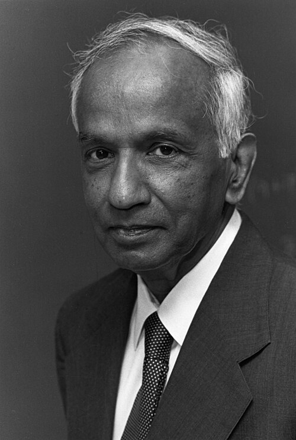

# Subrahmanyan Chandrasekhar (1910–1995)

  
  
<em>Subrahmanyan Chandrasekhar (1910–1995)</em>

## Overview

Subrahmanyan Chandrasekhar was an Indian-American astrophysicist whose 1930 calculation — completed on a steamship voyage from India to England — showed that stars above a certain mass cannot become white dwarfs and must collapse under gravity, implying the existence of what we now call neutron stars and black holes. His result, the Chandrasekhar limit, was rejected and publicly ridiculed by Arthur Eddington — one of the most eminent astrophysicists of the era — yet proved to be absolutely correct. Chandrasekhar received the Nobel Prize in Physics in 1983, fifty-three years after the calculation, "for his theoretical studies of the physical processes of importance to the structure and evolution of the stars."

## Early Life and Education

Chandrasekhar was born on 19 October 1910 in Lahore, then part of British India (now Pakistan), the third of ten children. His uncle, C.V. Raman, would win the Nobel Prize in Physics in 1930; Chandrasekhar later recalled that his uncle's achievement inspired him and showed that an Indian scientist could win the highest recognition. His mother, Sita Balakrishnan, translated Ibsen into Tamil and conveyed a love of learning to all her children.

Chandrasekhar studied at Presidency College, Madras, and published his first research paper — on Compton scattering — in the Proceedings of the Royal Society while still an undergraduate. He graduated with honors in physics in 1930 and won a Government of India scholarship to study at Cambridge under Ralph Fowler.

## The Chandrasekhar Limit: On the Steamship to England

The critical calculation occurred during the voyage from India to England in July 1930. Chandrasekhar had been reading Fowler's 1926 paper on white dwarf stars — which applied the new Fermi-Dirac statistics to show that white dwarfs are supported against collapse by electron degeneracy pressure. On the voyage, Chandrasekhar applied a relativistic correction to Fowler's analysis. The result was striking:

Relativistic effects weaken the degeneracy pressure relative to gravity for more massive stars. Chandrasekhar calculated that for stars above approximately **1.4 solar masses**, electron degeneracy pressure is insufficient to halt gravitational collapse — the star cannot end its life as a white dwarf, but must collapse to something denser.

This is the **Chandrasekhar limit** (more precisely, ≈1.44 M☉). Stars below this limit can become white dwarfs; above it, they must end as something more extreme.

## The Eddington Controversy

In 1935, at a meeting of the Royal Astronomical Society in London, Chandrasekhar presented his results on the upper mass limit for white dwarfs. Immediately after, Arthur Stanley Eddington — the most celebrated astrophysicist in Britain, the man who had confirmed general relativity in 1919 — rose to dismiss Chandrasekhar's result in the most humiliating possible terms. Eddington declared that there must be a physical law preventing such a collapse; the result was absurd; "I think there should be a law of nature to prevent a star from behaving in this absurd way." He accused Chandrasekhar of combining relativity and quantum mechanics in an illegitimate way.

Eddington was wrong on the physics. But his authority was such that most astrophysicists deferred to him, and Chandrasekhar's result was marginalized for decades. The episode deeply wounded Chandrasekhar — he was a young Indian scientist told by the most eminent British astrophysicist that his calculation was nonsense. He later said of the experience: "I felt very unhappy about it. I had spent two years of my life, and there was Eddington telling me that it was all wrong."

Rather than fight, Chandrasekhar moved on. Over the next fifty years he produced masterful, book-length treatments of one astrophysical topic after another.

## Encyclopedic Career Contributions

After the controversy, Chandrasekhar worked through — and wrote definitive mathematical treatises on — virtually every major area of classical astrophysics:

- **Stellar structure and stellar dynamics** (1939, 1942)
- **Radiative transfer** — the transport of radiation through stellar interiors (1950)
- **Hydrodynamic and hydromagnetic stability** — the theory of convection, stability of flows (1961)
- **Ellipsoidal figures of equilibrium** — self-gravitating fluid bodies (1969)
- **Black holes** — a comprehensive mathematical treatment of the Kerr and Schwarzschild metrics (1983)
- **The mathematical theory of colliding gravitational waves** (1983)

Each of these books became the standard reference in its field for decades.

## Nobel Prize and Later Recognition

The Nobel Prize in Physics in 1983 cited his work on stellar evolution. In announcing the award, the Nobel Committee confirmed what the physics community had long accepted: the Chandrasekhar limit is correct, fundamental, and one of the great results in astrophysics.

The Chandrasekhar limit is now understood as the dividing line between white dwarfs (below the limit) and neutron stars or black holes (above it). Type Ia supernovae — used as standard candles to discover the accelerating expansion of the universe (Nobel 2011) — occur when a white dwarf accretes matter and approaches the Chandrasekhar limit, triggering thermonuclear explosion. The limit is thus central to modern observational cosmology.

The Chandra X-ray Observatory, NASA's flagship X-ray telescope launched in 1999, is named in Chandrasekhar's honor.

Chandrasekhar became an American citizen in 1953 and spent most of his career at the University of Chicago, where he edited the Astrophysical Journal for nineteen years. He died on 21 August 1995 in Chicago.

## Legacy

The Chandrasekhar limit is a cornerstone of modern astrophysics and cosmology. His systematic mathematical treatments of astrophysical problems set the standard for theoretical work in the field. His response to humiliation — quiet persistence, widening mastery, and eventual vindication — is one of the most inspiring stories in scientific history.

## Key Works

- "The Maximum Mass of Ideal White Dwarfs" (1931)
- *An Introduction to the Study of Stellar Structure* (1939)
- *Radiative Transfer* (1950)
- *The Mathematical Theory of Black Holes* (1983)
