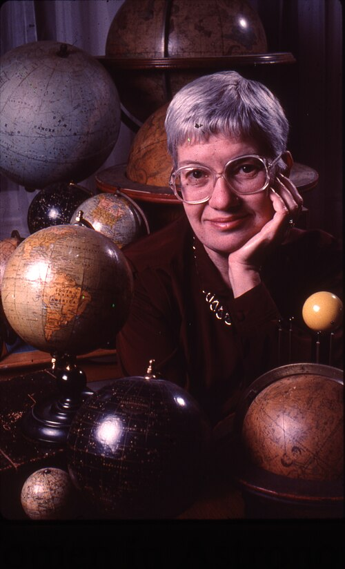

# Vera Rubin (1928–2016)

  
  
<em>Vera Rubin (1928–2016)</em>

## Overview

Vera Cooper Rubin was an American astronomer whose observations of galaxy rotation curves in the 1970s provided the most compelling evidence that the universe contains vast quantities of unseen matter — now called **dark matter**. Her meticulous measurements showed that stars in the outer regions of spiral galaxies move too fast to be held in orbit by the visible mass of those galaxies; an invisible halo of matter extending far beyond the visible disk must be present. Dark matter now accounts for approximately 27% of the total mass-energy of the universe and is one of the central problems of modern physics and cosmology. Rubin was widely regarded as deserving the Nobel Prize and her death in 2016 — before a Nobel was awarded — is considered one of the great oversights in the history of the prize.

## Early Life and Education

Rubin was born on 23 July 1928 in Philadelphia, Pennsylvania, and grew up in Washington, D.C. From childhood she was captivated by the stars she could see from her bedroom window, building her own telescope at twelve from cardboard and a lens. Her father, Philip Cooper, an electrical engineer, supported her interest enthusiastically.

She enrolled at Vassar College — one of the Seven Sisters women's liberal arts colleges — and graduated in 1948 as the only astronomy student in her class. She applied to Princeton's graduate astronomy program and was told, politely, that women were not accepted (Princeton's graduate astronomy program did not admit women until 1975). She enrolled instead at Cornell and completed her master's degree in 1951 under Philip Morrison and Martha Stahr Carpenter, submitting a thesis suggesting that galaxies might be rotating about some large-scale center — a prescient but controversial idea.

She then enrolled in the doctoral program at Georgetown University in Washington, chosen because it allowed her to care for her young children and because its astronomer, George Gamow, was there. She completed her doctorate in 1954 with a dissertation showing that galaxies tend to be distributed in clusters rather than uniformly — again, a result ahead of its time.

## Early Career Struggles

After her doctorate, Rubin applied for time on the major American telescopes — Palomar, Kitt Peak — and was initially unsuccessful, partly due to gender discrimination. She worked at Georgetown and then at the Carnegie Institution in Washington, where she spent her career. She was among the first women permitted to use the Palomar Observatory (in 1965).

In the 1960s she began a collaboration with the astronomer W. Kent Ford, who had built a highly sensitive spectrograph that could precisely measure the Doppler shifts of spectral lines — and therefore the velocities of stars and gas clouds in galaxies.

## Dark Matter: The Galaxy Rotation Curves

In 1970, Rubin and Ford published measurements of the rotation curve of the Andromeda galaxy — how fast stars at different distances from the center are moving. By Newtonian gravity, stars far from the galactic center (where most visible mass is concentrated) should orbit more slowly, just as the outer planets of the solar system move more slowly than the inner ones. What Rubin and Ford found was shocking: the rotation curve was **flat** — stars in the outer regions were orbiting just as fast as those near the center, or even faster.

This result implies that the mass enclosed within each orbital radius continues to increase even where no stars are visible. The galaxy is embedded in a vast halo of invisible, non-luminous matter extending far beyond the visible disk. They confirmed this result for dozens of spiral galaxies through the 1970s and 1980s, establishing the phenomenon as universal.

Fritz Zwicky had first noticed a similar problem in clusters of galaxies in 1933, but his result had been largely ignored. Rubin's measurements were precise, systematic, and unambiguous. They made dark matter a central problem of physics.

## Nature of Dark Matter

Dark matter is not ordinary baryonic matter (protons, neutrons, electrons). It does not emit, absorb, or reflect electromagnetic radiation. It interacts gravitationally but only extremely weakly (if at all) through other forces. The most favored candidates include Weakly Interacting Massive Particles (WIMPs) and axions, though none has been detected. The identity of dark matter remains one of the great open questions in physics.

## Recognition and Later Career

Rubin continued at Carnegie for her entire career, mentoring numerous students and continuing to study galaxy dynamics. She was elected to the National Academy of Sciences in 1981 — one of only four women in astronomy at the time. She received the National Medal of Science in 1993, the Gold Medal of the Royal Astronomical Society (the first woman so honored since Caroline Herschel in 1828), and the Bruce Medal of the Astronomical Society of the Pacific.

She was a consistent and passionate advocate for women in science and spoke candidly about discrimination she had experienced and observed. She wrote: "Fame is fleeting, my numbers mean more to me than my name. If astronomers are still using my data years from now, that's my greatest compliment."

Vera Rubin died on 25 December 2016 in Princeton, New Jersey. She had not received the Nobel Prize, despite being nominated repeatedly. The Vera C. Rubin Observatory, currently under construction in Chile (formerly the Large Synoptic Survey Telescope), has been renamed in her honor — the first major astronomical facility named after a woman.

## Legacy

Dark matter is one of the central mysteries of modern physics and cosmology. Rubin's galaxy rotation curves remain the most compelling observational evidence for its existence and are a starting point for any theory of galaxy formation. Her career also exemplifies the systematic exclusion of women from elite science — and the cost, to science and to the excluded individuals, of that exclusion.

## Key Works

- "Rotation of the Andromeda Nebula from a Spectroscopic Survey of Emission Regions" (with Ford, 1970)
- "Extended Rotation Curves of High-Luminosity Spiral Galaxies" (with Ford and Thonnard, 1978)
- *Bright Galaxies, Dark Matters* (collected papers, 1997)
