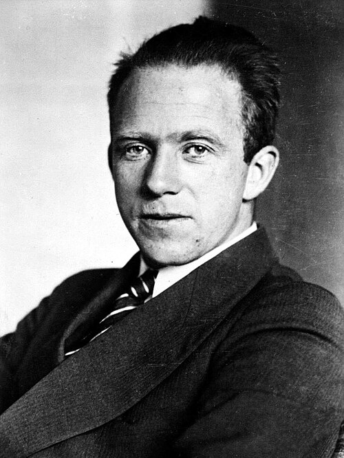

# Werner Heisenberg (1901–1976)

  
  
<em>Werner Heisenberg (1901–1976)</em>

## Overview

Werner Karl Heisenberg was a German theoretical physicist who invented matrix mechanics — the first mathematically complete formulation of quantum mechanics — and discovered the uncertainty principle, one of the most profound and debated results in the history of science. He received the Nobel Prize in Physics in 1932 "for the creation of quantum mechanics." His wartime leadership of the German nuclear weapons program and his postwar accounts of that period remain among the most controversial episodes in the history of twentieth-century physics.

## Early Life and Education

Heisenberg was born on 5 December 1901 in Würzburg, Bavaria. His father, August Heisenberg, was a professor of medieval and modern Greek at the University of Munich. Werner was an exceptional student who excelled in mathematics and physics. He studied at the University of Munich under Arnold Sommerfeld, who directed many of the leading physicists of the era. He also worked with Max Born in Göttingen and with Niels Bohr in Copenhagen — a triangulation that placed him at the center of the quantum revolution.

Heisenberg completed his doctorate at Munich in 1923 (his examination nearly failed because he could not explain the resolving power of a microscope — a topic that would later inspire his uncertainty principle) and became Born's assistant at Göttingen.

## Matrix Mechanics: The First Complete Quantum Theory

In June 1925, suffering from hay fever, Heisenberg retreated to the remote island of Helgoland in the North Sea. Working intensely, he developed a new approach to atomic physics that abandoned Bohr's intuitive picture of electron orbits entirely. Instead of asking where an electron is, he described atoms purely in terms of observable quantities — the frequencies and intensities of emitted radiation.

The result was a mathematical framework in which physical quantities are represented not by ordinary numbers but by arrays of numbers organized into tables — what Born immediately recognized as matrices. Heisenberg's "matrix mechanics" (further developed by Born and Pascual Jordan) was the first mathematically complete, consistent formulation of quantum mechanics. It correctly predicted atomic spectra and, when applied by Pauli to the hydrogen atom, reproduced Bohr's energy levels without ad hoc assumptions.

This was a conceptual revolution: Heisenberg had replaced the comfortable, if inconsistent, Bohr atom with an abstract mathematical structure that made no claims about what electrons "really do" between observations.

## The Uncertainty Principle

In 1927 Heisenberg derived his celebrated **uncertainty principle**: it is impossible to simultaneously determine the position and momentum of a particle with arbitrary precision. Quantitatively:

**Δx · Δp ≥ ℏ/2**

where ℏ = h/2π is the reduced Planck constant. A similar relation holds for energy and time: ΔE · Δt ≥ ℏ/2.

This is not a statement about measurement clumsiness or technological limitation. It is a fundamental feature of nature: position and momentum are incompatible observables — a particle with a perfectly definite position has a completely indefinite momentum, and vice versa. The same applies to energy and time.

Heisenberg illustrated this with a thought experiment: to observe an electron, you must shine light on it. But a photon with enough energy to determine position precisely will kick the electron with an uncertain amount of momentum. The uncertainty is irreducible.

The uncertainty principle ended the classical concept of a particle with a definite trajectory and is central to understanding atomic stability, the zero-point energy of the vacuum, quantum tunneling, and countless other phenomena.

## The Copenhagen Interpretation

Along with Bohr and Born, Heisenberg was a principal architect of the Copenhagen interpretation of quantum mechanics. He argued that quantum mechanics is a complete theory of observable phenomena, that the wave function does not represent a physical wave but a set of probability amplitudes for measurement outcomes, and that asking about a particle's properties prior to measurement is meaningless. His uncertainty principle was central to this interpretive stance.

## World War II and the German Nuclear Program

In 1941 Heisenberg met with Bohr in occupied Copenhagen — a meeting that has been reconstructed, debated, and dramatized (most famously in Michael Frayn's play *Copenhagen*) without resolution. Bohr came away with the impression that Heisenberg was working seriously on a German nuclear bomb; Heisenberg's postwar account suggested he was trying to signal to Bohr that German physicists did not want to build the bomb and were seeking Allied physicists' agreement on mutual restraint.

Whatever the truth, Germany never came close to a working nuclear weapon. Heisenberg led the German nuclear reactor program, which he later claimed was deliberately slowed; critics argue the Germans simply lacked sufficient resources and made crucial technical errors (including an incorrect calculation of the critical mass of uranium needed for a bomb).

After the war Heisenberg was interned at Farm Hall in England with other German scientists; the secretly recorded conversations there, published in 1992, show the Germans' genuine surprise and confusion when they heard about Hiroshima.

## Postwar Career

Heisenberg returned to Germany, helped found the Max Planck Institute for Physics (which he directed in Göttingen and later Munich), and became a leading figure in rebuilding German science. He worked on unified field theories in his later years, without great success. He was a vocal opponent of nuclear weapons and signed the Russell-Einstein Manifesto. He died on 1 February 1976 in Munich.

## Legacy

Matrix mechanics and the uncertainty principle are foundational to quantum mechanics and quantum field theory. The uncertainty principle has philosophical implications far beyond physics, touching on epistemology, the nature of causality, and the limits of knowledge. The element hassium (Hs, 108) is not named for Heisenberg, but the concept of the Heisenberg cut (the boundary between quantum and classical description) and the Heisenberg picture of quantum mechanics keep his name central to the daily practice of physics.

## Key Works

- "Über quantentheoretische Umdeutung kinematischer und mechanischer Beziehungen" (1925) — matrix mechanics
- "Über den anschaulichen Inhalt der quantentheoretischen Kinematik und Mechanik" (1927) — uncertainty principle
- *The Physical Principles of the Quantum Theory* (1930)
- *Physics and Philosophy* (1958)
