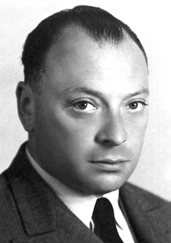

# Wolfgang Pauli (1900–1958)

  
  
<em>Wolfgang Pauli (1900–1958)</em>

## Overview

Wolfgang Ernst Pauli was an Austrian-Swiss theoretical physicist regarded by his contemporaries as the conscience of physics — the most exacting critic and the most penetrating analyst in a generation of extraordinary talent. His exclusion principle (1925) explains the structure of the periodic table and the stability of matter; his prediction of the neutrino (1930) — made purely on theoretical grounds to save conservation laws — was confirmed experimentally twenty-six years later. He received the Nobel Prize in Physics in 1945. Pauli was also famous for his acerbic wit and the semi-mythological "Pauli effect" — the supposed tendency for experimental apparatus to malfunction in his presence.

## Early Life and Education

Pauli was born on 25 April 1900 in Vienna, Austria. His father, Wolf Pauli (born Wolf Pascheles), was a physician and chemistry professor; his godfather was Ernst Mach, the physicist and philosopher of science whose ideas on empiricism deeply influenced the young Pauli. He showed exceptional mathematical ability from childhood and was bored by school. He entered the University of Munich to study under Arnold Sommerfeld, who recognized his genius immediately.

At nineteen Pauli wrote a review article on the special and general theories of relativity for an encyclopedia — an article Einstein himself praised as masterly. He received his doctorate from Munich in 1921. After a year with Born in Göttingen and time in Copenhagen with Bohr, he accepted a professorship in Hamburg in 1923 and later at ETH Zurich in 1928, where he remained (with interruptions) for the rest of his career.

## The Pauli Exclusion Principle

The central puzzle of atomic structure in the early 1920s was why electrons in atoms arrange themselves in the shells described by atomic spectroscopy — why, for example, the first shell holds 2 electrons, the second 8, and so on. Bohr's model had no explanation for this.

In January 1925 Pauli proposed his exclusion principle: no two electrons in an atom can occupy the same quantum state — i.e., no two electrons can have the same set of quantum numbers (n, l, m_l, m_s). Electrons "fill up" available states from the lowest energy, but once a state is occupied, no other electron can enter it.

This single principle explains:
- The structure of the periodic table — why elements repeat their chemical properties periodically
- The electronic configurations of all atoms
- The stability of matter (without the exclusion principle, all electrons would collapse into the lowest state and ordinary matter could not exist)
- The behavior of metals, semiconductors, and white dwarfs (Fermi-Dirac statistics)

The exclusion principle applies to all particles with half-integer spin — now called **fermions** in Fermi's and Dirac's honor. Pauli also introduced the concept of electron spin (at the same time as and independently of Goudsmit and Uhlenbeck), proposing a two-valuedness for electrons that became quantized spin.

## The Neutrino Hypothesis

In 1930 Pauli faced a crisis: experiments on beta decay (the emission of an electron from a radioactive nucleus) appeared to violate conservation of energy — the emitted electrons had a continuous range of energies, not the discrete values expected if only two particles were involved. Niels Bohr was prepared to abandon energy conservation. Pauli was not.

In a famous letter to "Dear radioactive ladies and gentlemen" attending a conference in Tübingen, Pauli proposed a desperate remedy: a new particle, electrically neutral and very light (possibly massless), was emitted along with the electron in beta decay, carrying away the missing energy undetected. He called it the neutron (before Chadwick's discovery renamed that particle); Fermi later named it the **neutrino** ("little neutral one").

Pauli worried that the neutrino might never be detected and that he had done something terrible. The neutrino was confirmed experimentally in 1956 by Cowan and Reines — twenty-six years after Pauli's prediction. Neutrinos are now known to come in three flavors and to have tiny but nonzero masses; they are among the most abundant particles in the universe.

## Quantum Field Theory and Pauli Matrices

Pauli made numerous other fundamental contributions. He derived the connection between spin and statistics: particles with integer spin (bosons) obey Bose-Einstein statistics; particles with half-integer spin (fermions) obey Fermi-Dirac statistics — the spin-statistics theorem. He introduced the **Pauli matrices** — four 2×2 matrices forming the mathematical basis for describing spin-1/2 particles — which appear throughout quantum mechanics and quantum field theory.

## The Pauli Effect

Pauli was legendarily destructive to experimental equipment — apparatus would break down, experiments fail, and instruments malfunction in his presence. The physicist Otto Stern reportedly banned Pauli from his laboratory. When a cyclotron at Princeton unexpectedly caught fire, Pauli was found to have been passing through Princeton on a train at the exact time. Physicists still invoke the "Pauli effect" half-seriously.

## Character and Psychology

Pauli was one of the most severe critics in physics — colleagues sought his approval (or feared his condemnation) more than anyone else's. His comment "not even wrong" — applied to theories so vague that they cannot even be tested — is still used today. He was also famously witty, producing remarks that have become part of the folklore of physics.

From 1930 onward Pauli engaged in an extended correspondence and occasional analytic sessions with the psychologist Carl Jung, a relationship documented in their published letters. Pauli was fascinated by the psychology of scientific discovery and by what he saw as parallels between quantum complementarity and Jungian archetypes. This unlikely collaboration produced the book *The Interpretation of Nature and the Psyche* (1952).

Pauli died on 15 December 1958 in Zurich of pancreatic cancer. His last reported words were to a nurse who he felt had been inattentive: "I'll die soon, and I expect you'll miss me."

## Legacy

The Pauli exclusion principle is one of the fundamental organizing principles of nature. Without it there would be no chemistry, no atoms as we know them, no solid matter. The neutrino hypothesis saved conservation of energy and predicted a particle that now plays central roles in nuclear physics, astrophysics, and cosmology.

## Key Works

- "Über den Zusammenhang des Abschlusses der Elektronengruppen im Atom mit der Komplexstruktur der Spektren" (1925) — exclusion principle
- Letter to "Dear radioactive ladies and gentlemen" (December 4, 1930) — neutrino hypothesis
- "The Connection Between Spin and Statistics" (1940) — spin-statistics theorem
- "Exclusion Principle and Quantum Mechanics" (Nobel Lecture, 1946)
